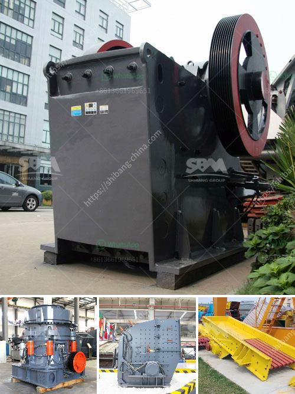

<h3>roller crusher for sale gumtree</h3>
Are you in need of a durable and efficient crusher to break down various materials? Look no further as the roller crusher for sale on Gumtree is the perfect solution for all your crushing needs. This reliable machine offers superior performance and can handle a wide range of materials with ease.

The roller crusher, also known as a double roll crusher, utilizes two cylinders that rotate in opposite directions. This design allows the rollers to efficiently crush materials such as coal, limestone, and many more. The crushing action is achieved by the combination of compression and shearing forces, ensuring the creation of uniform-sized particles.

One of the major advantages of the roller crusher is its simplicity of design and ease of operation. With just a few adjustments, the machine can be customized to suit your specific requirements. Whether you need fine-sized particles or coarse aggregates, the roller crusher can deliver the desired results.

Durability is another key feature of the roller crusher for sale on Gumtree. Constructed from high-quality materials, this machine is built to withstand heavy-duty use. The robust design ensures long-lasting performance, reducing the need for frequent maintenance and replacement.

Furthermore, the roller crusher offers excellent versatility. It can be used in various industries, including mining, construction, and chemical manufacturing. Its ability to process different types of materials makes it a valuable asset for any business.

When considering the purchase of a roller crusher, Gumtree is the ideal platform to find a wide range of options at competitive prices. The website allows sellers to showcase their products while providing detailed descriptions and images. This enables potential buyers to make informed decisions based on their specific requirements.

In conclusion, the roller crusher is an excellent solution for those in need of a reliable and efficient crushing machine. Its simplicity of design, durability, and versatility make it a valuable asset for various industries. Whether you are breaking down coal, limestone, or any other material, the roller crusher for sale on Gumtree is sure to fulfill all your crushing needs. So, don't hesitate – find your perfect roller crusher today!
<h3>Contact us</h3><ul><li><strong>Whatsapp:&nbsp;<a href="https://wa.me/8613661969651">+8613661969651</a></strong></li><li><a href="https://swt.shibang-china.com/?git&amp;zhl&amp;roller crusher for sale gumtree"><strong>Online Service(chat now)</strong></a></li></ul><h3>Related</h3><ul><li><a href='raymond mill grinding.md'>raymond mill grinding</a></li><li><a href='best portable jaw crusher granite.md'>best portable jaw crusher granite</a></li><li><a href='how to design stone crusher building.md'>how to design stone crusher building</a></li><li><a href='crush stone machinery.md'>crush stone machinery</a></li><li><a href='mica powder manufacturing process.md'>mica powder manufacturing process</a></li></ul>