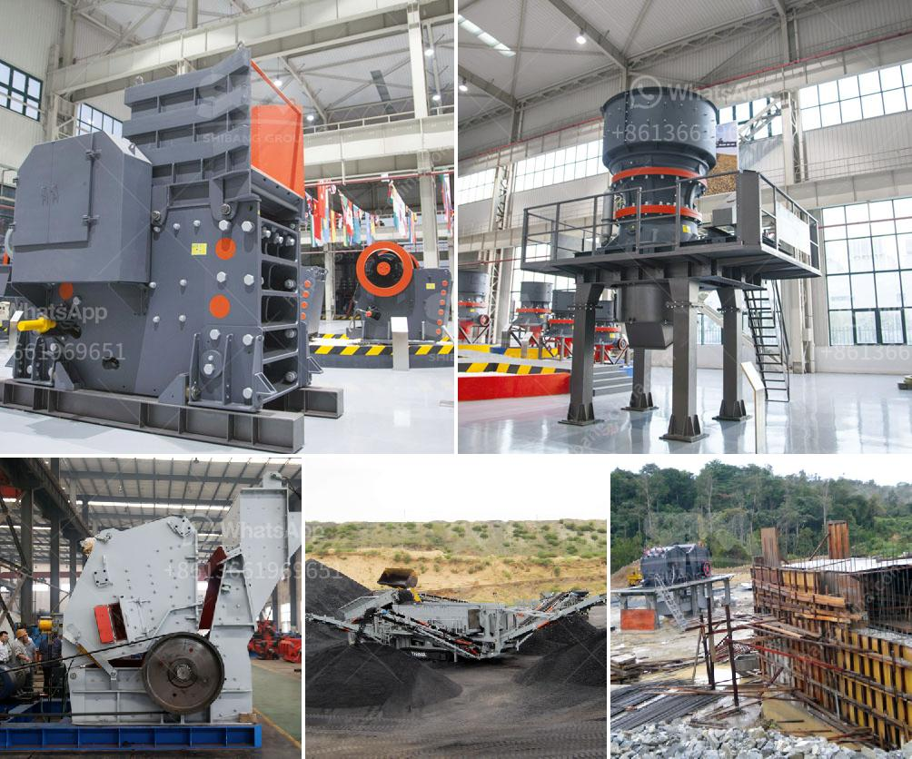

<h3>roller crusher price list</h3>
Roller crushers are commonly used as a secondary crushing device behind a primary crusher in building material, chemical, and mining industries. Keeping their focus on a specific market segment, they generally produce a price list with three types of products: primary roller crusher, secondary roller crusher, and tertiary roller crusher.

Primary roller crusher is suitable for crushing soft coal, ore, limestone, and other materials with a compressive strength less than 150 MPa. It comprises a pair of parallel cylindrical rollers that are horizontally mounted and driven by a motor through gear reducers. The crushed material is then passed through a screening machine to separate the desired product from the fines. The price range for the primary roller crusher is approximately $3,000 to $30,000.

Secondary roller crusher, also known as double-roller crusher, is suitable for crushing medium and high hardness materials such as limestone, coke, coal, etc. It is mainly used in cement production, mining, and power generation industries. The price range for the secondary roller crusher is around $4,000 to $35,000.

Tertiary roller crusher comes after the primary and secondary roller crushers to achieve further size reduction. It is used for crushing materials with a low to medium hardness, such as limestone, coal, and clay. This type of roller crusher consists of a series of closely spaced teeth that rotate in opposite directions and crush the material between them. The price range for the tertiary roller crusher is between $5,000 and $50,000.

It is important to note that the price of roller crushers can vary based on factors such as model, capacity, and manufacturer. Additionally, the prices listed here are approximate and can change over time due to market demand and inflation. It is recommended to contact the manufacturer directly for the most accurate and up-to-date pricing.

In conclusion, roller crushers offer a cost-effective and efficient solution for secondary and tertiary crushing. With a variety of models available and a wide price range, there is a roller crusher suitable for every application and budget.
<h3>Contact us</h3><ul><li><strong>Whatsapp:&nbsp;<a href="https://wa.me/8613661969651">+8613661969651</a></strong></li><li><a href="https://swt.shibang-china.com/?git&amp;zhl&amp;roller crusher price list"><strong>Online Service(chat now)</strong></a></li></ul><h3>Related</h3><ul><li><a href='gypsum production line for making.md'>gypsum production line for making</a></li><li><a href='manganese ore concentrate south africa.md'>manganese ore concentrate south africa</a></li><li><a href='mobile stone crushers for sale south africa.md'>mobile stone crushers for sale south africa</a></li><li><a href='rock crusher screen.md'>rock crusher screen</a></li><li><a href='barite crushing machine from germany.md'>barite crushing machine from germany</a></li></ul>