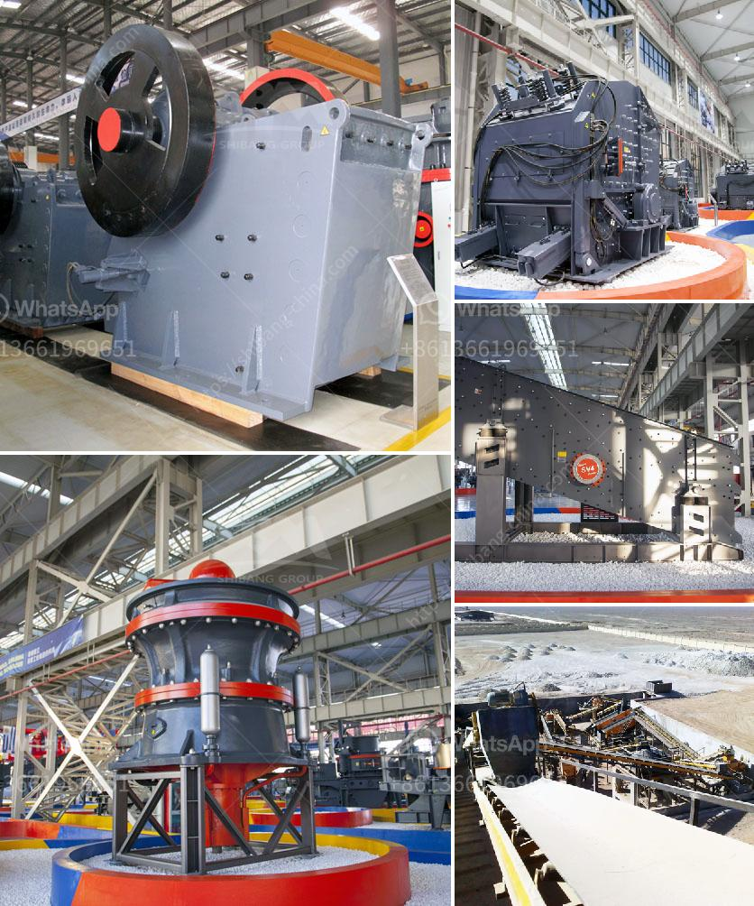

<h3>roller grinding machines for sale</h3>
Roller grinding machines can be an excellent addition to any manufacturing or industrial operation. These machines are used to grind various types of materials, such as metals, ceramics, plastics, and more. They provide accurate and efficient grinding, allowing for high-precision results while enhancing productivity and reducing costs.

One of the major advantages of roller grinding machines is their versatility. With multiple rollers and a range of different grinding techniques available, these machines can accommodate a wide variety of materials and applications. Whether it's removing excess material from a workpiece, polishing a surface to a high gloss finish, or providing a fine and precise finish, roller grinding machines are capable of it all.

Another significant benefit of roller grinding machines is their durability. These machines are built to withstand heavy-duty use and are designed to last for many years, even in the most demanding environments. This means that investing in a roller grinding machine can provide a long-term solution for your grinding needs, saving you money on repairs and replacements in the long run.

Additionally, roller grinding machines for sale come with advanced features and technologies that further enhance their performance and efficiency. Some machines offer automatic controls, allowing for precise and consistent grinding results. Others have built-in coolant systems to prevent overheating and maintain the quality of the workpiece. These features make roller grinding machines a valuable asset for any manufacturing facility striving for excellence in their grinding processes.

If you are looking to invest in a roller grinding machine, there are many options available on the market. It's essential to consider factors such as the size of the machine, the materials it can handle, and the level of automation you require. Additionally, comparing prices and specifications from different suppliers can help make an informed decision and find the best machine for your specific needs.

In conclusion, roller grinding machines for sale offer numerous advantages for industrial and manufacturing operations. Their versatility, durability, and advanced features make them a valuable asset, improving productivity and achieving high-precision grinding results. If you're in the market for a grinding machine, consider investing in a roller grinding machine to enhance your operation's efficiency and profitability.
<h3>Contact us</h3><ul><li><strong>Whatsapp:&nbsp;<a href="https://wa.me/8613661969651">+8613661969651</a></strong></li><li><a href="https://swt.shibang-china.com/?git&amp;zhl&amp;roller grinding machines for sale"><strong>Online Service(chat now)</strong></a></li></ul><h3>Related</h3><ul><li><a href='fly ash grinding.md'>fly ash grinding</a></li><li><a href='concrete crushing machine price in china.md'>concrete crushing machine price in china</a></li><li><a href='pulverizer for carbon black.md'>pulverizer for carbon black</a></li><li><a href='mining crusher plants in egypt.md'>mining crusher plants in egypt</a></li><li><a href='business plan for coal processing.md'>business plan for coal processing</a></li></ul>