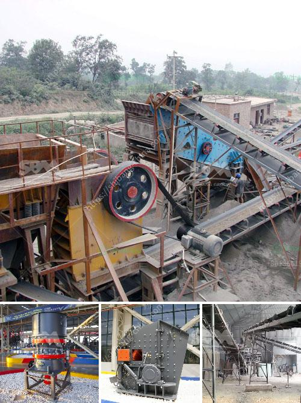

<h3>roller mill compontes</h3>
Roller mills are mills that utilize cylindrical rollers to crush, grind, and pulverize materials in various industries. The key components of a roller mill include grinding rollers, bearings, and drives. Let's take a closer look at these essential parts and how they contribute to the functionality of roller mills.

The grinding rollers are the most critical components of a roller mill as they generate the force needed to grind the materials. Typically, roller mills feature two to five smooth or corrugated rollers. The choice of roller configuration depends on the specific requirements of the application. Corrugated rollers with grooves aid in enhancing the grippiness of the materials, resulting in better grinding and reducing slippage.

Bearings play a crucial role in the smooth operation of roller mills. They support the weight of the grinding rollers and enable them to rotate freely. Roller mill bearings must be capable of handling heavy loads, high speeds, and intense vibrations. Typically, roller mills employ spherical roller bearings due to their capacity to withstand these conditions. These bearings have a high load capacity and self-aligning capabilities, ensuring smooth operation and prolonging the lifespan of the roller mill.

The drive system is another vital component of a roller mill. It provides the power necessary to rotate the grinding rollers and facilitate the grinding process. Roller mills commonly use electric motors to drive the rotation. The motor is connected to the roller mill through a system of belts and pulleys or directly coupled with the mill. The drive system must be robust and reliable to deliver consistent performance under heavy loads and varying operating conditions.

To ensure the longevity and efficiency of a roller mill, proper maintenance and regular inspections of these components are crucial. Routine lubrication of bearings is necessary to avoid excessive friction, overheating, and premature wear. Additionally, periodic inspection of the grinding rollers is essential to identify any signs of damage, excessive wear, or misalignment. Any faulty or worn-out components should be promptly replaced to prevent further damage and maintain optimal performance.

Roller mills find applications in various industries, including food processing, pharmaceuticals, mining, and agriculture. They are extensively used for grinding grains, legumes, minerals, and other bulk materials. Roller mills offer several advantages over traditional milling equipment, such as high efficiency, precise control of particle size, and low maintenance requirements.

In conclusion, roller mills consist of key components that contribute to their functionality and efficiency. Grinding rollers, bearings, and drives are integral parts that work together to crush, grind, and pulverize materials. Proper maintenance and regular inspections are essential to ensure their smooth operation and prolong their lifespan. Roller mills continue to play a crucial role in various industries, offering reliable and efficient grinding solutions.
<h3>Contact us</h3><ul><li><strong>Whatsapp:&nbsp;<a href="https://wa.me/8613661969651">+8613661969651</a></strong></li><li><a href="https://swt.shibang-china.com/?git&amp;zhl&amp;roller mill compontes"><strong>Online Service(chat now)</strong></a></li></ul><h3>Related</h3><ul><li><a href='stone crushing equipment south africa.md'>stone crushing equipment south africa</a></li><li><a href='start up granite quarry business.md'>start up granite quarry business</a></li><li><a href='mineral pulverising ball mill manufacturer in india.md'>mineral pulverising ball mill manufacturer in india</a></li><li><a href='slag powder grinding in india.md'>slag powder grinding in india</a></li><li><a href='clay crusher manufacture process.md'>clay crusher manufacture process</a></li></ul>