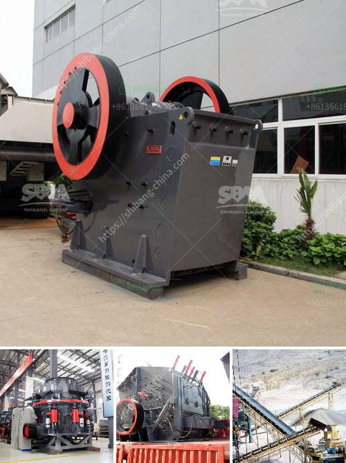

<h3>roller mill famsun</h3>
The feed and grain industry has always been driven by the pursuit of efficiency, quality, and maximum productivity. In recent years, the roller mill has emerged as a game-changer, promising immense advantages over traditional milling methods. Among the top players in this market, Famsun stands out with its cutting-edge Roller Mill technology that has revolutionized the industry.

Famsun is a renowned global leader in animal feed, grain milling, and extrusion systems. With a diverse range of products and solutions, they continually strive to enhance the efficiency and profitability of their customers. One of their standout offerings is the Famsun Roller Mill, which has transformed the process of grain milling.

At the heart of Famsun's Roller Mill lies its innovative design, leveraging advanced technological features to optimize the production process. The roller mill consists of multiple pairs of parallel grinding rolls, which rotate in opposite directions to crush and grind grains. Its unique design ensures consistent particle size reduction and uniformity, leading to superior quality feed and grain products.

Famsun Roller Mills are known for their unrivaled performance in terms of energy efficiency and reduced operating costs. The milling process is highly mechanized, enabling increased production rates without compromising product quality. By reducing maintenance and downtime, Famsun Roller Mills enhance operational efficiency, providing a competitive advantage to feed and grain producers.

Moreover, the Roller Mill's versatility is an added benefit. It can process various types of grains, including corn, wheat, barley, and sorghum, catering to different market demands. Famsun Roller Mills are ideal for both small-scale and large-scale milling operations, meeting the diverse needs of feed mills, flour mills, and breweries.

Another standout feature of Famsun's Roller Mill is its state-of-the-art automation and control systems. These systems enable remote monitoring and control of the milling process, ensuring optimal performance and reducing human error. With real-time data tracking and analysis, operators can make informed decisions to maximize productivity and quality.

Famsun Roller Mills also excel in food safety and hygiene standards. The milling process is enclosed within a sealed environment, preventing contamination and foreign particles from entering the final product. This not only ensures food safety but also extends the shelf life of the grain products, minimizing waste and improving overall profitability.

Furthermore, Famsun prioritizes sustainability in their Roller Mill design. The efficient use of energy reduces the environmental impact, while the advanced dust collection systems ensure minimal emissions. Famsun is committed to providing eco-friendly solutions, aligning with the global focus on sustainable practices.

In a rapidly evolving industry, Famsun Roller Mill has established itself as an industry leader, helping feed and grain producers stay ahead of the curve. With their unmatched efficiency, advanced automation, and commitment to sustainability, Famsun Roller Mills have become a preferred choice in the market.

The roller mill technology has truly revolutionized the feed and grain industry, with Famsun leading the way. As customer demands for quality, efficiency, and sustainability continue to rise, Famsun Roller Mill remains at the forefront, constantly innovating and pushing the boundaries of milling technology. With their expertise and commitment to excellence, Famsun is poised to shape the future of feed and grain milling.
<h3>Contact us</h3><ul><li><strong>Whatsapp:&nbsp;<a href="https://wa.me/8613661969651">+8613661969651</a></strong></li><li><a href="https://swt.shibang-china.com/?git&amp;zhl&amp;roller mill famsun"><strong>Online Service(chat now)</strong></a></li></ul><h3>Related</h3><ul><li><a href='gypsum powder machine for sale.md'>gypsum powder machine for sale</a></li><li><a href='pe series jaw crusher and ton per day.md'>pe series jaw crusher and ton per day</a></li><li><a href='smallest cement plant.md'>smallest cement plant</a></li><li><a href='screening coal crushing plant.md'>screening coal crushing plant</a></li><li><a href='price stone crusher suppliers.md'>price stone crusher suppliers</a></li></ul>