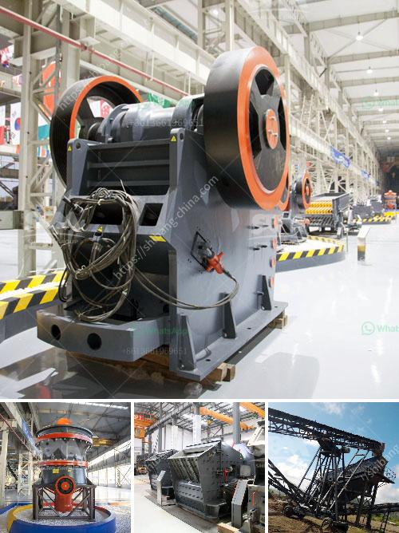

<h3>roller mill machine for mining</h3>
Roller mill machines have become a crucial part of the mining industry in recent years. With advancements in technology and greater demand for minerals and metals, the need for more efficient and reliable grinding machines has become paramount. Roller mill machines offer numerous benefits to the mining industry, including better efficiency, enhanced product quality, and reduced energy consumption. In this article, we will explore the various advantages of roller mill machines in mining operations.

One of the primary benefits of roller mill machines in mining is their ability to efficiently grind materials. Roller mills utilize multiple rollers that exert pressure on the material being ground, resulting in a highly efficient and uniform grinding process. This allows for finer particles to be obtained, improving the overall quality of the final product. Whether it is coal, cement, or minerals, roller mill machines can handle a wide range of materials with ease.

In addition to superior grinding capabilities, roller mill machines are also highly reliable. Their robust design and sturdy construction enable them to withstand the harsh operating conditions often encountered in mining operations. Roller mills are designed to withstand heavy loads and extreme temperatures, ensuring uninterrupted and reliable operation. This reliability is crucial in the mining industry as any downtime can result in significant production losses and costly repairs.

Energy efficiency is another significant advantage offered by roller mill machines. Compared to traditional grinding methods, roller mills consume significantly less energy. The efficient grinding process of roller mills reduces the need for additional energy-intensive processes, thereby reducing overall energy consumption. This not only translates into cost savings but also reduces the environmental impact associated with mining operations.

Furthermore, roller mill machines offer greater flexibility in terms of feedstock characteristics. The adjustable gap between the rollers allows for precise control over the size of the final product. This flexibility enables mining companies to produce different particle sizes as per their specific requirements. Whether it is coarse, medium, or fine grinding, roller mill machines can be easily adjusted to deliver the desired outcome.

Last but not least, roller mill machines also contribute to improved safety in mining operations. Their enclosed design prevents dust and particles from escaping, reducing the risk of respiratory issues for the workers. Additionally, roller mills are equipped with advanced safety features to ensure the protection of personnel and prevent accidents.

In conclusion, roller mill machines have revolutionized the mining industry by offering enhanced efficiency, superior product quality, reduced energy consumption, and improved safety. Their ability to grind a wide range of materials efficiently makes them indispensable in modern mining operations. As the demand for minerals and metals continues to grow, roller mill machines will only become more prevalent and play an even more critical role in ensuring the success and sustainability of mining operations.
<h3>Contact us</h3><ul><li><strong>Whatsapp:&nbsp;<a href="https://wa.me/8613661969651">+8613661969651</a></strong></li><li><a href="https://swt.shibang-china.com/?git&amp;zhl&amp;roller mill machine for mining"><strong>Online Service(chat now)</strong></a></li></ul><h3>Related</h3><ul><li><a href='alluvial wash plants in south africa.md'>alluvial wash plants in south africa</a></li><li><a href='machinery to crush quartz.md'>machinery to crush quartz</a></li><li><a href='mica powder manufacturing process.md'>mica powder manufacturing process</a></li><li><a href='impact crusher for sale in saudi arabia.md'>impact crusher for sale in saudi arabia</a></li><li><a href='pe series jaw crusher and ton per day.md'>pe series jaw crusher and ton per day</a></li></ul>