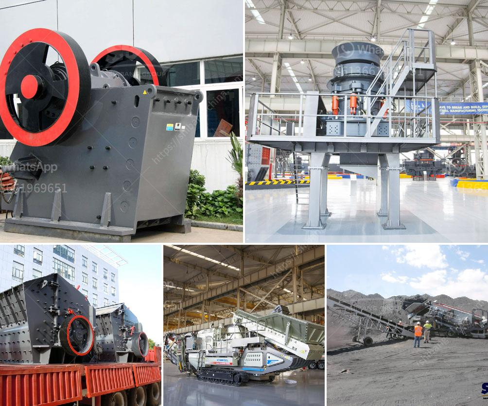

<h3>roller mill process machine</h3>
The roller mill process machine is a piece of equipment used in the industrial and agricultural sectors to break down and finely crush material into a powder format. This machine applies pressure and shear forces between two rollers to break apart the material and create a more consistent and uniform product.

The roller mill process machine is commonly used in the food processing industry to create flour and other grain-based products. It is also used in the pharmaceutical, chemical, and mining industries to grind minerals and other substances into a fine powder. This versatile machine is known for its efficiency and ability to produce high-quality products.

One of the key advantages of the roller mill process machine is its ability to handle a wide range of materials. It can process everything from soft and fibrous materials like grains and seeds to harder substances like minerals and ore. This makes it a valuable tool for various industries that need to crush and grind different types of materials.

In terms of operation, the roller mill process machine is relatively straightforward. The material is fed into the machine through a hopper or chute and is then crushed between the two rotating rollers. The pressure and shear forces exerted by the rollers break down the material, reducing it to the desired particle size.

One of the main benefits of using a roller mill process machine is its efficiency. The machine can process materials quickly and consistently. This saves time and money for businesses, as it increases productivity and reduces the need for manual labor.

Furthermore, the roller mill process machine produces a more consistent and uniform product compared to other grinding methods. The evenly crushed material ensures a higher quality end product, which is crucial for industries that require precise specifications.

Another advantage of the roller mill process machine is its low maintenance requirements. The machine is designed to withstand heavy use and is built with durable materials, reducing the need for frequent repairs or replacement parts. Regular cleaning and maintenance can ensure the longevity and optimal performance of the machine.

In conclusion, the roller mill process machine is a versatile and efficient tool used in various industries. Its ability to handle a wide range of materials, high productivity, and low maintenance requirements make it a valuable asset for businesses. Whether it is used to create flour, grind minerals, or process other substances, this machine consistently produces high-quality products. With its reliable performance and durability, the roller mill process machine is an investment worth considering for businesses in need of a reliable and efficient grinding solution.
<h3>Contact us</h3><ul><li><strong>Whatsapp:&nbsp;<a href="https://wa.me/8613661969651">+8613661969651</a></strong></li><li><a href="https://swt.shibang-china.com/?git&amp;zhl&amp;roller mill process machine"><strong>Online Service(chat now)</strong></a></li></ul><h3>Related</h3><ul><li><a href='hand powered rock crusher binq mining.md'>hand powered rock crusher binq mining</a></li><li><a href='small stone crusher machine in italy.md'>small stone crusher machine in italy</a></li><li><a href='egypt aggregate stone for concrete prices.md'>egypt aggregate stone for concrete prices</a></li><li><a href='mobile gold processing plant in russia.md'>mobile gold processing plant in russia</a></li><li><a href='ton hour coal crusher and screen.md'>ton hour coal crusher and screen</a></li></ul>