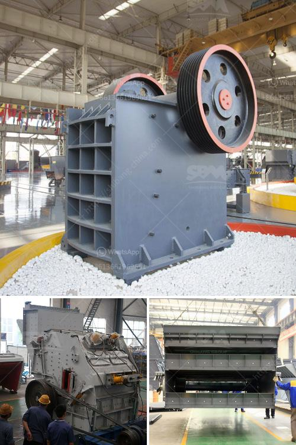

<h3>roller raymond mill with best price</h3>
Grinding is an essential operation in various industries like mining, cement, and mineral processing. To meet the demands of these industries, the market offers a wide array of grinding mills. However, when it comes to efficiency, reliability, and cost-effectiveness, Roller Raymond Mill stands out among the competition.

Roller Raymond Mill, also known as the Raymond roller mill, is a commonly used grinding mill in industrial production. Through the continuous improvement and innovation, Roller Raymond Mill has achieved significant performance advantages. With its advanced technology, energy-saving feature, and remarkable price advantage, Roller Raymond Mill quickly gained popularity among the industry professionals.

One of the key advantages of Roller Raymond Mill is its high grinding efficiency. The grinding roller and grinding ring are finely processed and made of high-quality materials, ensuring the smooth operation and long service life of the equipment. The high rotation speed of the grinding roller further enhances its grinding efficiency, allowing for the production of fine powder with a high pass rate.

In addition to its grinding efficiency, Roller Raymond Mill also boasts an outstanding energy-saving feature. The advanced grinding principle and technological innovation greatly reduce the energy consumption during the grinding process. Its intelligent control system precisely adjusts the feed rate and roller pressure according to the fineness and hardness of the material, ensuring a more energy-efficient operation.

Aside from its superior performance, another compelling factor that sets Roller Raymond Mill apart is its attractive price. Compared to other similar grinding mills in the market, Roller Raymond Mill offers a more cost-effective solution. The manufacturer adopts a streamlined production process, reducing production costs without compromising the quality. This allows the customers to obtain a high-quality grinding mill at a competitive price.

Furthermore, Roller Raymond Mill is user-friendly, easy to operate, and maintain. With its advanced design, the equipment provides convenient access to internal components, making maintenance and repair quick and hassle-free. The stable and reliable performance also minimizes the downtime, ensuring continuous production and maximizing the overall productivity.

To meet the diverse needs of different industries, Roller Raymond Mill is available in various models and specifications. Customers can choose the appropriate model based on their specific requirements, such as the production capacity, fineness of the final product, and input size of the raw material. The versatility and flexibility of Roller Raymond Mill make it suitable for a wide range of grinding applications.

In conclusion, Roller Raymond Mill with its best price offers an unmatched grinding experience in terms of efficiency, energy-saving, and cost-effectiveness. Its superior performance, attractive price, and user-friendly features make it a preferred choice among industry professionals. With Roller Raymond Mill, businesses can achieve higher productivity, reduce production costs, and enhance their competitive edge in the market.
<h3>Contact us</h3><ul><li><strong>Whatsapp:&nbsp;<a href="https://wa.me/8613661969651">+8613661969651</a></strong></li><li><a href="https://swt.shibang-china.com/?git&amp;zhl&amp;roller raymond mill with best price"><strong>Online Service(chat now)</strong></a></li></ul><h3>Related</h3><ul><li><a href='machinery for magnesium extracted from dolomite.md'>machinery for magnesium extracted from dolomite</a></li><li><a href='quarry crusher equipments and machinery.md'>quarry crusher equipments and machinery</a></li><li><a href='sand screening machine in malaysia.md'>sand screening machine in malaysia</a></li><li><a href='how to make unq stone crusher.md'>how to make unq stone crusher</a></li><li><a href='how to start gold mining in ghana.md'>how to start gold mining in ghana</a></li></ul>