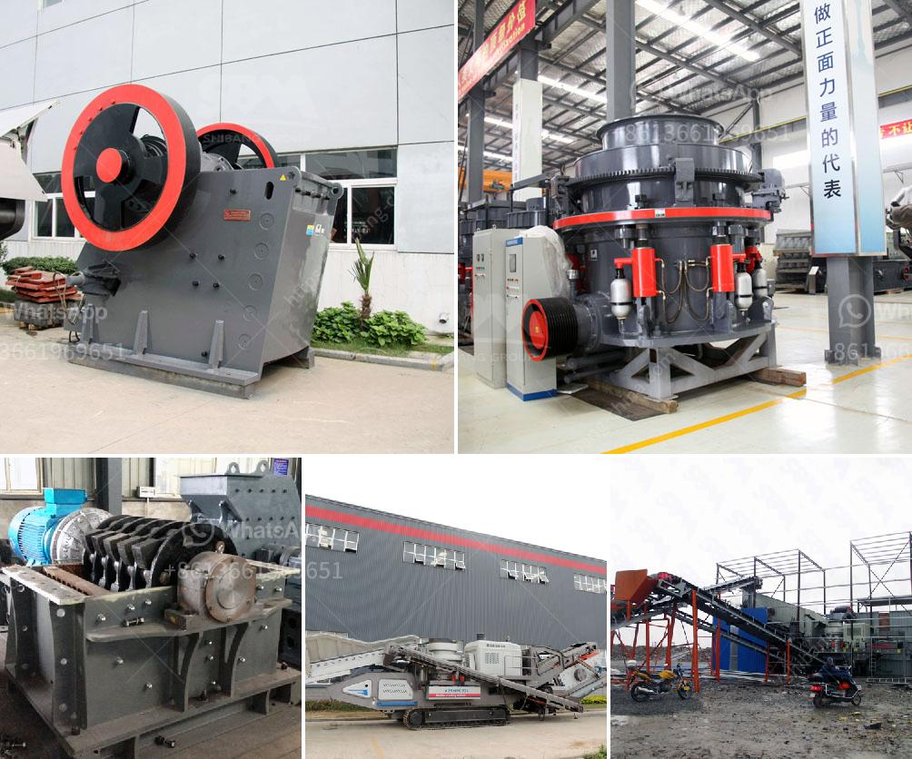

<h3>rotary kilns in indonesia</h3>
Rotary kilns are a crucial part of industrial processes in Indonesia. These large-scale cylindrical heating devices are used for various applications, ranging from cement production to waste incineration. With their high temperature and continuous operation, rotary kilns play a significant role in transforming raw materials into valuable products.

One of the primary uses of rotary kilns in Indonesia is for cement production. The country is experiencing rapid urbanization and infrastructural development, driving the demand for cement. Rotary kilns are instrumental in producing this essential building material by converting limestone and clay into clinker. The clinker is then ground to produce cement, contributing to the growth of the construction industry.

Furthermore, rotary kilns have gained popularity in Indonesia for their contribution to waste management practices. With mounting concerns over environmental pollution and limited landfill space, rotary kilns provide an efficient solution for waste incineration. These kilns offer controlled combustion of solid waste at high temperatures, eliminating harmful materials and reducing waste volume. The heat generated during the incineration process can also be harnessed to generate electricity or provide heat for other industrial processes.

Several factors contribute to the successful operation of rotary kilns in Indonesia. The availability of high-quality raw materials, such as limestone and clay, ensures the production of excellent cement. Additionally, strict monitoring and adherence to emission regulations are essential to minimize the environmental impact of waste incineration.

However, challenges do exist in maintaining and operating rotary kilns. The high temperatures and continuous operation can lead to mechanical challenges and energy consumption. Regular maintenance and the implementation of advanced technologies are necessary to ensure optimal performance and efficiency.

In conclusion, rotary kilns play a vital role in Indonesia's industrial sector. From cement production to waste incineration, these devices contribute to the country's development, catering to the increasing demands of construction and waste management. Continuous innovation and responsible operation will further enhance the effectiveness of rotary kilns in Indonesia, promoting sustainable industrial practices.
<h3>Contact us</h3><ul><li><strong>Whatsapp:&nbsp;<a href="https://wa.me/8613661969651">+8613661969651</a></strong></li><li><a href="https://swt.shibang-china.com/?git&amp;zhl&amp;rotary kilns in indonesia"><strong>Online Service(chat now)</strong></a></li></ul><h3>Related</h3><ul><li><a href='mining equipment agent in iran.md'>mining equipment agent in iran</a></li><li><a href='ball mill for solutions.md'>ball mill for solutions</a></li><li><a href='mining process of marble crusher.md'>mining process of marble crusher</a></li><li><a href='20mm feeding hydraulic cone crusher price.md'>20mm feeding hydraulic cone crusher price</a></li><li><a href='ball mill manufacturer india.md'>ball mill manufacturer india</a></li></ul>