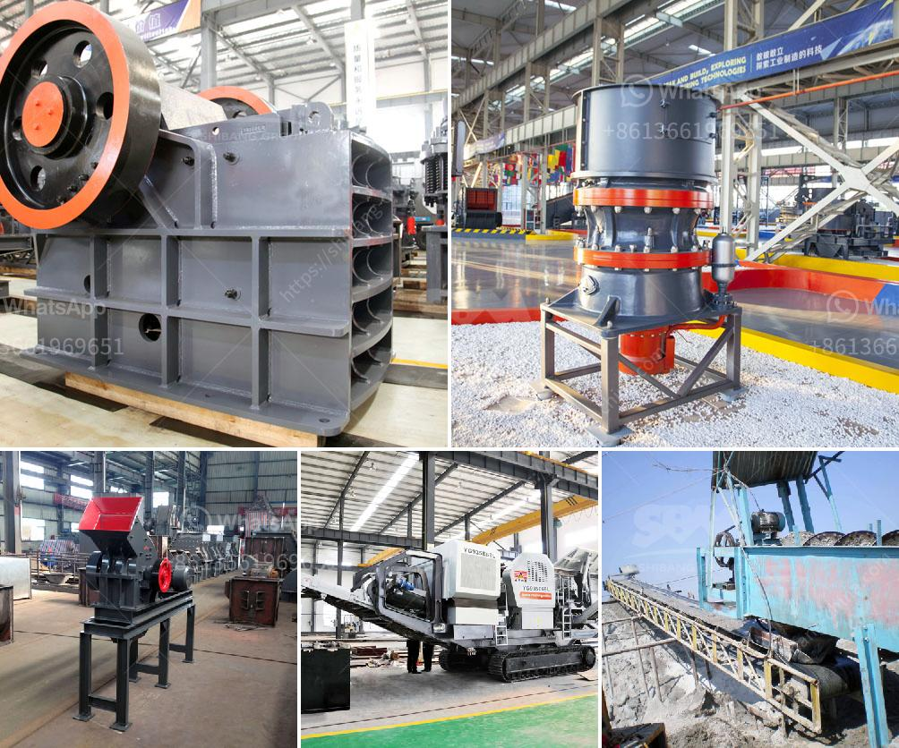

<h3>rudra industries ball mill manufacturers</h3>
In the world of industrial equipment, Rudra Industries has carved a niche for itself as a leading manufacturers of ball mills. With a rich legacy of more than three decades, the company has consistently delivered efficient and reliable milling solutions to a wide range of industries.

The ball mill is a critical piece of equipment for grinding crushed materials into fine powders, and Rudra Industries ensures that every mill manufactured meets the highest quality standards. The company employs advanced manufacturing techniques and robust materials to ensure the longevity and durability of each ball mill.

One of the key factors that sets Rudra Industries apart from its competitors is its unwavering commitment to innovation. The company's team of engineers and technicians constantly strive to improve the design and functionality of their ball mills. This dedication to innovation has resulted in cutting-edge features such as improved motor efficiency, enhanced cooling systems, and precise control mechanisms.

The range of ball mills manufactured by Rudra Industries caters to a diverse set of requirements. From small-scale laboratories to large-scale industrial plants, the company offers a wide variety of mill sizes and configurations to meet specific customer needs. Additionally, they provide customization options, allowing clients to tailor the mill to their specific application.

Apart from their commitment to quality and innovation, Rudra Industries is also highly regarded for its exceptional customer service. The company believes in building long-term relationships with its clients, offering prompt assistance, technical support, and after-sales service. Their team of experts is always available to address any queries or concerns, ensuring customer satisfaction throughout the product's lifecycle.

Moreover, Rudra Industries prioritizes sustainability and efficiency in its manufacturing processes. The company employs eco-friendly practices and utilizes energy-efficient technologies to minimize its carbon footprint. This commitment to sustainability aligns with their goal of delivering environmentally responsible solutions to their clients.

In conclusion, Rudra Industries has established itself as a trusted and reliable manufacturer of ball mills. With a focus on quality, innovation, customer service, and sustainability, the company continues to revolutionize the milling industry. Whether it's for chemical processing, mining, or any other application, the ball mills manufactured by Rudra Industries are the epitome of efficiency and performance.
<h3>Contact us</h3><ul><li><strong>Whatsapp:&nbsp;<a href="https://wa.me/8613661969651">+8613661969651</a></strong></li><li><a href="https://swt.shibang-china.com/?git&amp;zhl&amp;rudra industries ball mill manufacturers"><strong>Online Service(chat now)</strong></a></li></ul><h3>Related</h3><ul><li><a href='nigeria rock crusher for sale.md'>nigeria rock crusher for sale</a></li><li><a href='fine cone crusher.md'>fine cone crusher</a></li><li><a href='vertical roller mill in cement plant.md'>vertical roller mill in cement plant</a></li><li><a href='magnesite processing plant.md'>magnesite processing plant</a></li><li><a href='crushing stone crusher in spinal.md'>crushing stone crusher in spinal</a></li></ul>