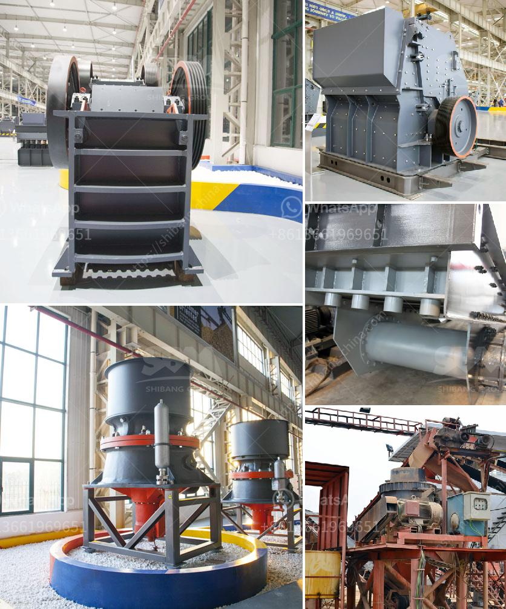

<h3>running sponge iron plant for sale in gujarat</h3>
Gujarat, known for its robust industrial environment, is home to numerous industries that contribute significantly to the state's economic growth. One such industry that has gained prominence over the years is the sponge iron plant. Sponge iron, commonly known as direct reduced iron (DRI), is a raw material used in steelmaking. It is produced by reducing iron ore in the form of lumps, pellets, or fines with a reducing gas such as coal or natural gas.

If you are in the market to buy a running sponge iron plant in Gujarat, you have made a wise decision. Gujarat provides the ideal setting for such a venture, with its abundant natural resources, skilled labor force, and well-established infrastructure. Let's delve into the key aspects of running a sponge iron plant in Gujarat.

Location: Selecting the right location for your sponge iron plant is crucial. Gujarat offers several industrial zones and industrial parks that provide strategically advantageous locations. These industrial zones have developed infrastructure, proximity to transportation networks, and access to essential utilities like power, water, and raw materials.

Government Policies: Gujarat has been at the forefront of implementing investor-friendly policies and creating a favorable business environment. The state government provides various incentives and benefits like tax breaks, subsidies, and ease of doing business regulations. These policies play a crucial role in attracting investors to the state and fostering industrial growth.

Raw Material Availability: One of the significant advantages of setting up a sponge iron plant in Gujarat is its proximity to iron ore mines. The state possesses substantial iron ore reserves, ensuring a steady and reliable supply of raw material. This proximity reduces transportation costs, making it economically viable to operate a sponge iron plant in Gujarat.

Skilled Workforce: Gujarat has a skilled labor force with expertise in operating and managing industrial units, including sponge iron plants. The state's focus on education and skill development has resulted in a qualified talent pool. This availability of skilled workers ensures smooth operations and enhances productivity in your plant.

Infrastructure: Gujarat boasts excellent infrastructure, including well-connected road networks, ports, and railways. This facilitates the transportation of finished products and raw materials, streamlining the supply chain. Moreover, the state has a reliable power supply, which is crucial for running a sponge iron plant.

Market Potential: Gujarat's sponge iron industry has immense market potential. It supplies its products to various steel plants, both within the state and across the country. With India's increasing demand for steel, driven by infrastructure development and the automotive sector, the sponge iron plant in Gujarat stands to benefit from the growing market.

Conclusion: Acquiring a running sponge iron plant in Gujarat presents a lucrative opportunity for investors. The state's favorable business environment, abundant raw materials, skilled workforce, and robust infrastructure make it an ideal location for such an enterprise. With the growing demand for steel, a sponge iron plant in Gujarat holds immense potential for profit and success. So, if you are considering venturing into the sponge iron industry, Gujarat should definitely be on your radar!
<h3>Contact us</h3><ul><li><strong>Whatsapp:&nbsp;<a href="https://wa.me/8613661969651">+8613661969651</a></strong></li><li><a href="https://swt.shibang-china.com/?git&amp;zhl&amp;running sponge iron plant for sale in gujarat"><strong>Online Service(chat now)</strong></a></li></ul><h3>Related</h3><ul><li><a href='grinding machine manufacturers ethiopia.md'>grinding machine manufacturers ethiopia</a></li><li><a href='gold mining equipment manufacturers.md'>gold mining equipment manufacturers</a></li><li><a href='mica powder manufacturing process.md'>mica powder manufacturing process</a></li><li><a href='turkey stone crushers.md'>turkey stone crushers</a></li><li><a href='portable quarry crushers for sale in the usa.md'>portable quarry crushers for sale in the usa</a></li></ul>