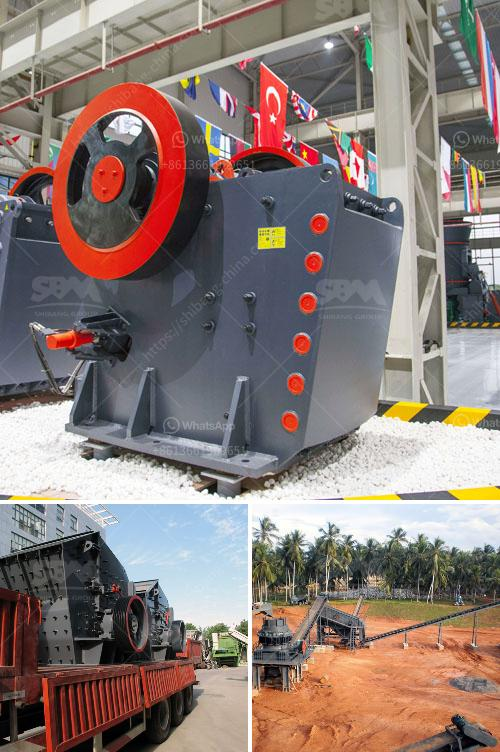

<h3>safety poster for coal handling plant</h3>
Coal handling plants play a crucial role in power generation, ensuring the continuous supply of coal to boilers. However, these facilities are prone to various hazards, including fires, explosions, and trapped gas accidents. To mitigate these risks, it becomes essential to promote safety awareness among workers by employing effective communication tools such as safety posters. This article explores the significance of safety posters in coal handling plants, their key elements, and how they can positively impact worker safety.

Safety posters serve as visual reminders of potential hazards and safe work practices. In a bustling coal handling plant, workers may encounter various dangers and overlook safety protocols due to a fast-paced and high-pressure environment. Safety posters, therefore, act as constant reminders, reinforcing the importance of adhering to safety guidelines and precautions. By prominently displaying these visuals, employers can foster a safety-conscious culture and reduce the likelihood of individual negligence or oversight.

1. Clear and concise messaging: Safety posters should convey vital information using simple and concise language. This ensures that the message is quickly understood, regardless of language barriers or time constraints. Bullet points, brief descriptions, or pictograms can all enhance comprehension.

2. Eye-catching graphics and colors: Posters featuring vibrant colors and visually appealing graphics are more likely to capture workers' attention. By attracting their gaze, these posters encourage engagement and facilitate effective communication of safety information.

3. Relevant and specific content: Safety posters must address site-specific risks and hazards in coal handling plants. It is crucial to examine each area of the facility, identifying potential dangers and incorporating them into the poster's content. For instance, posters might highlight the risks associated with conveyor belts, dust accumulations, or the proper use of personal protective equipment.

4. Encouraging safe behaviors: In addition to highlighting potential hazards, safety posters should actively promote safe behaviors. Positive reinforcement can serve as a powerful motivator, inspiring workers to develop safer habits and celebrate proactive safety measures.

1. Workplace culture transformation: Safety posters contribute to developing a safety-conscious culture by providing a constant visual reminder of best practices, PPE usage, and hazard awareness. This culture shift fosters individual and collective accountability for safety within the coal handling plant.

2. Increased hazard awareness: By emphasizing specific hazards and potential risks, safety posters enhance workers' understanding of potential dangers unique to coal handling plants. Employees become more cautious and alert, thus minimizing the likelihood of accidents and injuries.

3. Continuous reinforcement: Unlike training sessions that occur periodically, safety posters remain in visible areas throughout the facility, delivering consistent reinforcement. Regular exposure to safety messages increases retention and helps embed safety protocols into workers' daily routines.

4. Multilingual support: Safety posters with universal symbols and visually intuitive graphics can overcome language barriers commonly faced in diverse work environments. This aspect ensures that safety information is effectively communicated to all workers, irrespective of their native language.

Safety posters are indispensable tools in coal handling plants, promoting safety awareness, and precautionary measures among workers. By incorporating key elements such as clear messaging, eye-catching graphics, and site-specific content, these posters can positively impact worker safety. They serve as constant reminders, fostering a safety-conscious culture, increasing hazard awareness, and reinforcing safe behaviors. Ultimately, effective safety posters contribute to a safer and more secure working environment within coal handling plants.
<h3>Contact us</h3><ul><li><strong>Whatsapp:&nbsp;<a href="https://wa.me/8613661969651">+8613661969651</a></strong></li><li><a href="https://swt.shibang-china.com/?git&amp;zhl&amp;safety poster for coal handling plant"><strong>Online Service(chat now)</strong></a></li></ul><h3>Related</h3><ul><li><a href='hammer mill price south africa.md'>hammer mill price south africa</a></li><li><a href='grinding of copper ores.md'>grinding of copper ores</a></li><li><a href='price of industrial hammer mill.md'>price of industrial hammer mill</a></li><li><a href='hammer mill technical.md'>hammer mill technical</a></li><li><a href='crushing machine manufacturers china.md'>crushing machine manufacturers china</a></li></ul>