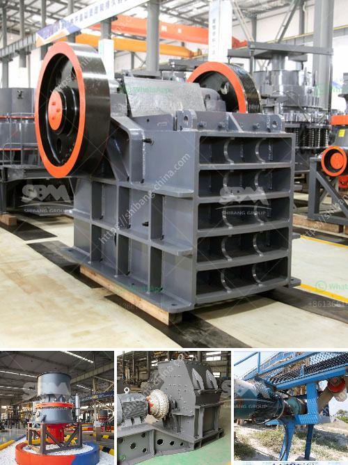

<h3>safety videos of belt conveyors in hindi</h3>
बेल्ट कन्वेयर्स की सुरक्षा वीडियोज़ के बारे में एक लेख

आधुनिक सतह पर बड़ी संख्या में उपयोग होने वाले यांत्रिकी साधनों में से एक है बेल्ट कन्वेयर. यह साधन उत्पादों, धातु, कागज, सूखी फसल और अन्य माल को संकलित करने और इसे एक स्थान से दूसरे स्थान पर पहुंचाने के लिए विशेष उपयोग होता है. बेल्ट कन्वेयर्स आपके उद्योग में समय और श्रम दोनों को कम करने का काम करते हैं. इन साधनों का उपयोग करके आप बहुत आसानी से विभिन्न उत्पादों को एक जगह से दूसरी जगह पहुंचा सकते हैं, जिन्हें हाथों से ढोना काफी कठिन होता है.

हालांकि, बेल्ट कन्वेयर्स को सुरक्षित तरीके से चलाने के लिए उचित सावधानी बरतनी चाहिए. यहां बेल्ट कन्वेयर उपयोग करने के लिए सुरक्षा वीडियोज़ का महत्व होता है. ये वीडियोज़ लोगों को इसे सुरक्षित तरीके से चलाने के लिए बेहतर समझ बाँध देते हैं और उन्हें नियमों और दिशानिर्देशों का पालन करने में मदद करते हैं.

पहले बात करें इन वीडियोज़ में किसी खतरनाक स्थिति के बारे में. इन वीडियोज़ में दिखाए जाते हैं अवियोज्य, विपणनीय या खतरनाक स्थिति, जो बेल्ट कन्वेयर के उपयोगकर्ता के लिए हो सकती हैं. इन स्थितियों का पता लगाना महत्वपूर्ण है ताकि लोग सुरक्षितता के बारे में ज्ञान प्राप्त कर सकें और इन्हें बचने के लिए उचित कदम उठा सकें.

यहां एक महत्वपूर्ण बिंदु है कि वीडियो में दृश्यगत दिशानिर्देश भी दिए जाते हैं. यह दिखाता है कि कैसे कन्वेयर का सही तरीके से ऑपरेट करें, कैसे सुरक्षा उपकरण जैसे सुरक्षा गोगल, पर्दे और प्रतिरोध की संरचना सही तरीके से धारण करें, और कैसे किसी भी मुद्दे के साथ सही ढंग से निपटें.

इन वीडियोज़ में सभी साधनों के उपयोग में प्रामाणिकता भी दिखाई जाती है. सही तरीके से परीक्षण और अनुरोध की जाती है ताकि कोई भी यांत्रिकी समस्या पहले ही निपटा जा सके और यांत्रिकी भूलों की संख्या घटी जा सके.

ये समर्पित वीडियोज़ सिर्फ उपयोगकर्ता की सुरक्षा के लिए होते हैं. यहां इन वीडियोज़ में बताया जाता है कि जब कन्वेयर ऑपरेट होता है, तो लोगों को कैसे संतुलन बनाए रखना चाहिए, कैसे खतरों से बचना चाहिए और कैसे हादसे की संभावना से निपटें. इससे उपयोगकर्ता का समय बचता है, साथ ही संकट से निपटने की कोशिश करने की आवश्यकता से भी बचा जाता है.

बेल्ट कन्वेयर्स की सुरक्षा वीडियोज़ एक महत्वपूर्ण साधन होते हैं जो लोगों को इस प्राकृतिक संकलन और पहुंच के साधन को सुरक्षितता और क्षमता से चलाने के लिए जागरूक करते हैं. इन वीडियोज़ को देखने का समय यांत्रिकी सुरक्षा और सुरक्षित काम के लिए निवेश है और इससे हमारे उद्योग को कठिनाइयों से बचाने में मदद मिलती है.
<h3>Contact us</h3><ul><li><strong>Whatsapp:&nbsp;<a href="https://wa.me/8613661969651">+8613661969651</a></strong></li><li><a href="https://swt.shibang-china.com/?git&amp;zhl&amp;safety videos of belt conveyors in hindi"><strong>Online Service(chat now)</strong></a></li></ul><h3>Related</h3><ul><li><a href='ball mill of small size.md'>ball mill of small size</a></li><li><a href='stone crusher machine philippines.md'>stone crusher machine philippines</a></li><li><a href='cone crusher zenith.md'>cone crusher zenith</a></li><li><a href='sample gold processing and mining business plan pdf.md'>sample gold processing and mining business plan pdf</a></li><li><a href='crusher machine suppliers.md'>crusher machine suppliers</a></li></ul>