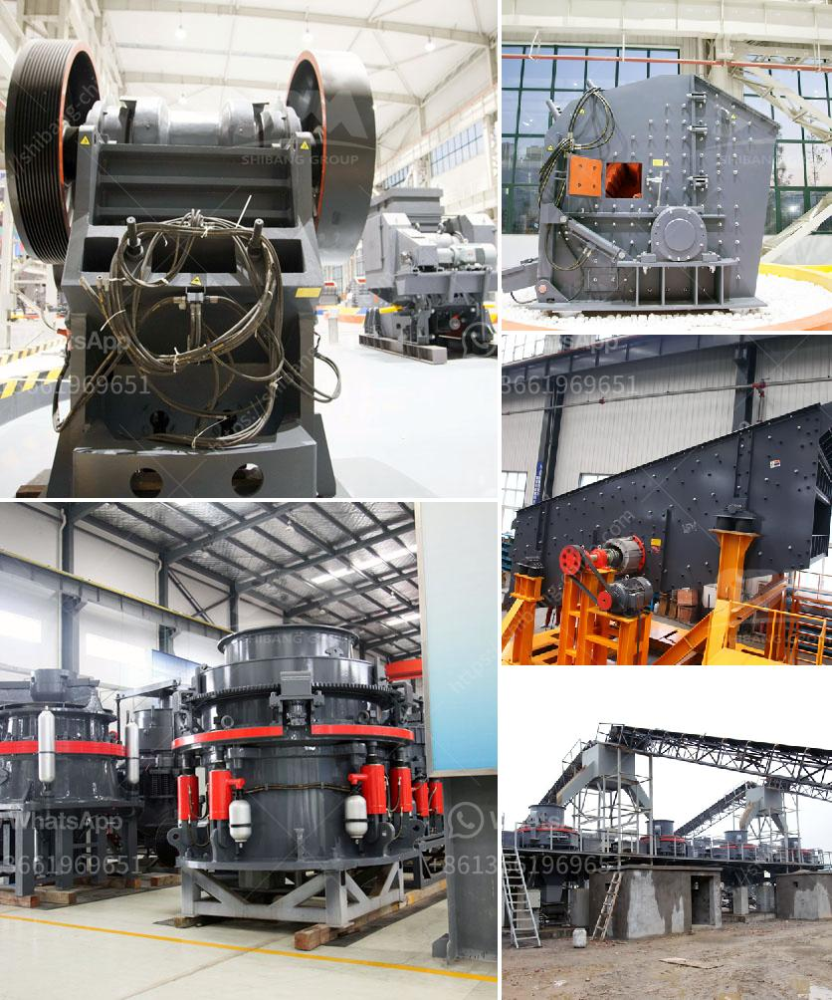

<h3>sample business plan for gold mine</h3>
A sample business plan for a gold mine can be helpful in understanding the key elements that should be included in a business plan for this type of venture. A gold mine business plan will not only shape your idea into a structured plan but also provide guidance in addressing potential hurdles along the way.

The first section of the business plan should provide an overview of the gold mine, including its location, size, and the estimated amount of gold that can be extracted. This section should also include a brief description of the mining process and the equipment needed.

Next, the business plan should detail the management and operational structure of the gold mine. This includes information about the key personnel involved, their roles, and their qualifications. It should also outline the plan for hiring and training additional staff as needed.

The marketing and sales section of the business plan should explain how the gold extracted from the mine will be sold. This includes identifying potential buyers such as jewelry manufacturers or investors interested in gold bullion. The plan should also address any marketing strategies that will be employed to attract and retain customers.

Financial projections are a crucial aspect of any business plan. For a gold mine, these projections should include estimates of startup costs, ongoing mining expenses, and projected revenues. It is important to consider factors such as gold prices, volume of production, and operational costs to ensure accurate forecasting.

Lastly, the business plan should address potential risks and challenges associated with running a gold mine. This includes potential environmental concerns, regulatory requirements, and health and safety considerations. It is crucial to demonstrate a solid understanding of these factors and present a plan for minimizing their impact.

In conclusion, a sample business plan for a gold mine is an essential tool for entrepreneurs looking to venture into the mining industry. It provides a roadmap for success, addressing the key elements required to run a profitable gold mine, such as location, management structure, marketing strategies, financial projections, and risk management.
<h3>Contact us</h3><ul><li><strong>Whatsapp:&nbsp;<a href="https://wa.me/8613661969651">+8613661969651</a></strong></li><li><a href="https://swt.shibang-china.com/?git&amp;zhl&amp;sample business plan for gold mine"><strong>Online Service(chat now)</strong></a></li></ul><h3>Related</h3><ul><li><a href='chrome mining methods in zimbabwe.md'>chrome mining methods in zimbabwe</a></li><li><a href='cost of glass aggregate machines.md'>cost of glass aggregate machines</a></li><li><a href='quartz powder making machine in andhra pradesh.md'>quartz powder making machine in andhra pradesh</a></li><li><a href='used raymond mills barite raymond mill.md'>used raymond mills barite raymond mill</a></li><li><a href='price of gypsum processing plant.md'>price of gypsum processing plant</a></li></ul>