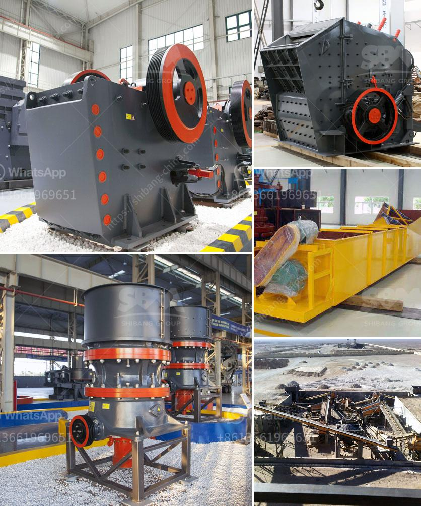

<h3>sample gold processing and mining business plan pdf</h3>
A mining business plan PDF can help entrepreneurs and stakeholders to align their business strategies with goals and objectives. The sample gold processing and mining business plan PDF showcased above will serve as a useful guide when you want to draft your business plan. With the sample business plan as a guide, you can create a detailed plan, specific to your project, to ensure a smooth implementation process.

Gold mining operations range from tiny to gigantic. Definitely, location and size of the operation will determine how a miner will start a gold mine. All these must be captured in even a small scale gold mining business proposal. Here is a sample business plan for starting a gold mining company.

3. Dig where exposed bedrock is on the claim and where waterways collect gold in the beds of the river/stream around the inside curve of a bend or on the downstream side of any natural obstacles to the flow of water such as boulders or obstructions.

5. Separate the probable gold from the waste material at the point of entry in the water channel behind the boulders or obstacles.

As a novice gold miner, you may have some questions. How can I meet someone in the business and get an actual sample of a business plan in the mining sector? A business plan will be your roadmap to success, and getting someone from the industry to guide you through would be highly beneficial. You could also reach out to industry associations, attend mining conferences, and network with experts who can provide insights and advice.

In conclusion, the sample gold processing and mining business plan PDF showcased above will help you get started with your proposed project. It covers all the necessary steps to plan and launch your mining business successfully. Remember to seek professional advice and support to ensure that your business plan aligns with industry best practices and regulations to achieve your goals.
<h3>Contact us</h3><ul><li><strong>Whatsapp:&nbsp;<a href="https://wa.me/8613661969651">+8613661969651</a></strong></li><li><a href="https://swt.shibang-china.com/?git&amp;zhl&amp;sample gold processing and mining business plan pdf"><strong>Online Service(chat now)</strong></a></li></ul><h3>Related</h3><ul><li><a href='roll crushers for rent.md'>roll crushers for rent</a></li><li><a href='equipment for ferro manganese plant.md'>equipment for ferro manganese plant</a></li><li><a href='hammer crusher dimension.md'>hammer crusher dimension</a></li><li><a href='stone crusher machine usato in italy.md'>stone crusher machine usato in italy</a></li><li><a href='mobile stone crusher machine price.md'>mobile stone crusher machine price</a></li></ul>