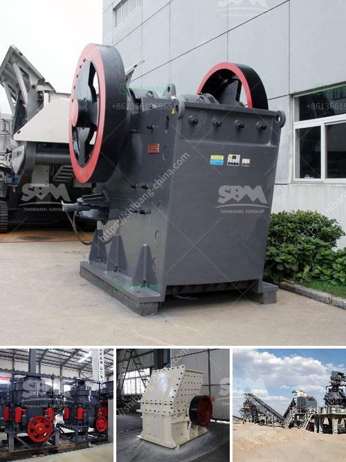

<h3>sample of a business proposal for a block factory</h3>
Starting a new business venture in the construction industry requires significant planning and organization. One such lucrative opportunity in this field is establishing a block factory. A block factory manufactures and sells concrete blocks used in various construction projects. If you are considering starting a block factory, it is essential to create a comprehensive business proposal that showcases your vision, objectives, and strategies. In this article, we will present a sample business proposal for a block factory to help you get started.

The executive summary is a brief overview of your business proposal, including the purpose, target market, and financial projections. It should highlight key selling points, such as the demand for construction materials in your location and the competitive advantage of your block factory.

Provide a detailed description of your block factory, including its location, production capacity, and the types of blocks you plan to manufacture. Consider including information about your production process, machinery and equipment required, and the estimated cost of setting up the factory.

Conduct a thorough market analysis to understand the demand for concrete blocks in your target market. Identify potential customers, such as construction companies, builders, and individuals involved in home construction or renovation projects. Explore market trends, growth opportunities, and potential challenges to develop effective marketing and sales strategies.

Analyze your competitors in the block manufacturing industry. Identify their strengths and weaknesses, pricing strategies, and quality of materials. Identify how your block factory can differentiate itself to stand out in the market, whether through superior quality, competitive pricing, or exceptional customer service.

Outline your marketing and sales strategies to attract and retain customers. This may include advertising through various channels like local print media, online platforms, and industry exhibitions. Establish a sales team and specify how they will engage with potential clients to generate leads and secure contracts.

Detail the day-to-day operations of your block factory. Outline the roles and responsibilities of the management team and staff, and specify the required workforce. Describe the manufacturing process, from procuring raw materials to packaging and distribution.

Provide a detailed financial forecast, including startup costs, expected revenue, fixed and variable expenses, and projected profits. This section should demonstrate the viability and financial feasibility of your block factory. Include cash flow projections, break-even analysis, and return on investment calculations.

Address sustainability and environmental concerns in your business proposal. Highlight initiatives such as using eco-friendly materials, implementing waste management practices, or utilizing alternative energy sources. Showcase your commitment to reducing the industry's carbon footprint while maintaining profitability.

Identify potential risks and challenges that may affect your block factory's operations and profitability. This could include changes in market demand, material price fluctuations, or supply chain disruptions. Develop strategies to manage or mitigate these risks effectively.

Wrap up your business proposal by summarizing the key points and emphasizing the potential success of your block factory. Reiterate your unique selling proposition and the benefits customers can expect by choosing your products. End with a call to action, encouraging the reader to support your venture.

Remember, this sample business proposal provides a framework for creating a powerful and persuasive document. Customize it to suit your specific block factory and local market conditions to increase the chances of securing funding and support for your business endeavor. Good luck!
<h3>Contact us</h3><ul><li><strong>Whatsapp:&nbsp;<a href="https://wa.me/8613661969651">+8613661969651</a></strong></li><li><a href="https://swt.shibang-china.com/?git&amp;zhl&amp;sample of a business proposal for a block factory"><strong>Online Service(chat now)</strong></a></li></ul><h3>Related</h3><ul><li><a href='latest three roll mills.md'>latest three roll mills</a></li><li><a href='milling processing for small scale mining.md'>milling processing for small scale mining</a></li><li><a href='sayaji stone crushers ahmedabad.md'>sayaji stone crushers ahmedabad</a></li><li><a href='vrm vertical roller mill.md'>vrm vertical roller mill</a></li><li><a href='stone crusher for sale in uae.md'>stone crusher for sale in uae</a></li></ul>