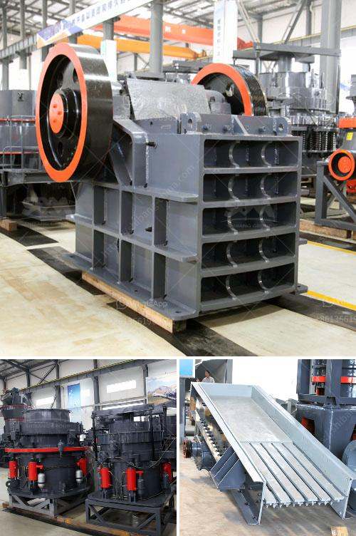

<h3>sample of project proposal in mining</h3>
A mining project proposal is a document outlining the key objectives and proposed methodology of a mining project. Mining refers to the extraction of valuable minerals or other geological materials from the earth. There are various techniques and methods used in mining and the extraction process.

A well-developed project proposal is crucial for obtaining financial support and approval from stakeholders. It serves as a roadmap for executing the project effectively and efficiently. The proposal should clearly state the purpose of the project, its scope, deliverables, and anticipated timeline. Additionally, it should outline the resources required and a cost analysis for the project.

We, [Company Name], hereby propose to conduct a mining exploration project in [Location]. The objective of this project is to explore and assess the potential of [Mineral Resource] in the area.

- Conducting a comprehensive literature review on the geological formations, mineral deposits, and mining history of the region.

- Collecting geological data through field surveys, including mapping, sampling, and analyzing various mineral occurrences.

- Conducting geophysical surveys, including ground-based electromagnetic and magnetic surveys, to understand the subsurface characteristics.

- Analysing the samples collected in laboratories to determine the composition, grade, and commercial viability of the mineral deposits.

Our exploration activities will follow industry best practices and adhere to regulatory requirements. We will form a team of experienced geologists, mining engineers, and environmental specialists who will execute the project. The team will utilize state-of-the-art equipment and software to ensure accurate data collection, analysis, and interpretation.

The project is expected to be completed within [Timeframe]. The exact timeline will depend on various factors, including weather conditions, availability of equipment and resources, and regulatory approvals.

We estimate the total project cost to be [Estimated Cost]. The budget will cover all project activities, including personnel expenses, equipment rental, laboratory analysis, and administrative costs. A detailed cost breakdown is available upon request.

The aforementioned project proposal outlines our plan to undertake a comprehensive mining exploration project at [Location]. We are confident that this project will provide valuable insights into the mineral potential of the area, which could lead to future mining operations. We seek financial support and necessary approvals to commence the project and contribute to the growth of the mining industry in [Location].

In conclusion, a well-prepared project proposal is essential for the success of any mining project. It provides a structured and detailed plan for executing the project and ensures that all stakeholders are aligned regarding the objectives, scope, and resources required. By following best practices and adhering to regulatory requirements, mining projects can be conducted responsibly and sustainably, benefiting the industry and local communities.
<h3>Contact us</h3><ul><li><strong>Whatsapp:&nbsp;<a href="https://wa.me/8613661969651">+8613661969651</a></strong></li><li><a href="https://swt.shibang-china.com/?git&amp;zhl&amp;sample of project proposal in mining"><strong>Online Service(chat now)</strong></a></li></ul><h3>Related</h3><ul><li><a href='iron ore vibrator screen.md'>iron ore vibrator screen</a></li><li><a href='how to dismantle brand jaw crusher.md'>how to dismantle brand jaw crusher</a></li><li><a href='gold mining production line or gold mining plant.md'>gold mining production line or gold mining plant</a></li><li><a href='rock crusher supplier.md'>rock crusher supplier</a></li><li><a href='ash grinding machine.md'>ash grinding machine</a></li></ul>