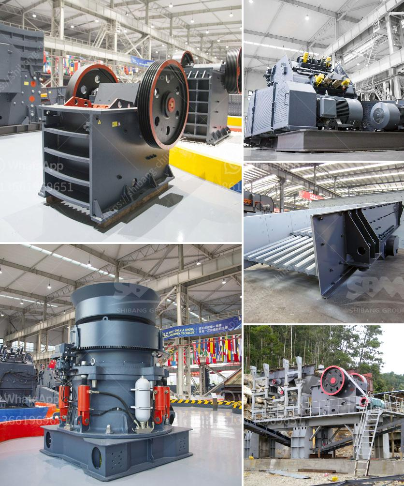

<h3>sand and gravel crusher</h3>
Sand and gravel crusher, also known as a stone crusher, is a machine that helps to crush rocks and stones into smaller pieces. It is especially useful for obtaining gravel and sand for construction purposes. This crusher is essential in the construction industry because it allows you to crush materials such as granite, limestone, and concrete into suitable sizes for different uses.

One of the main uses of sand and gravel crusher is in the production of cement. Cement is made by mixing cement clinker, gypsum, and other crushed materials together. The crushed materials are obtained from quarries and are then crushed by a crusher. The crusher ensures that the materials are crushed into smaller pieces before being used in the production of cement. This allows for more efficient mixing and ensures that the cement produced is of high quality.

Another important use of sand and gravel crusher is in the production of concrete. Concrete is a versatile building material widely used in construction projects. It is made by mixing cement, water, sand, and gravel. The sand and gravel used in the production of concrete are obtained from quarries and then crushed by a crusher. The crusher ensures that the materials are crushed into appropriate sizes, which are then mixed together to form concrete. This produces concrete of the desired strength and durability.

Sand and gravel crusher are also used in road construction projects. Roads require a durable and stable foundation to withstand heavy traffic and various weather conditions. The crushed materials obtained from a crusher are used as a base or sub-base layer for constructing roads. This layer ensures that the road is strong and stable, preventing issues such as potholes and cracks. The crushed materials also provide excellent drainage, reducing the risk of waterlogging or flooding on the road surface.

In addition to construction purposes, sand and gravel crusher is also used in landscaping and gardening projects. These crushers help to crush rocks and stones into smaller pieces that can be used as decorative elements in gardens, walkways, and driveways. The crushed materials can be used to create pathways or as a base for laying pavers or tiles. Additionally, they can be used to create raised flowerbeds or rock gardens, adding aesthetic value to outdoor spaces.

In conclusion, sand and gravel crushers play a crucial role in the construction industry. They help to crush rocks and stones into smaller pieces, which are then used for various purposes such as producing cement, manufacturing concrete, constructing roads, and enhancing landscapes. These crushers are essential for ensuring the quality and durability of construction materials, providing a solid foundation for buildings, roads, and other infrastructure projects.
<h3>Contact us</h3><ul><li><strong>Whatsapp:&nbsp;<a href="https://wa.me/8613661969651">+8613661969651</a></strong></li><li><a href="https://swt.shibang-china.com/?git&amp;zhl&amp;sand and gravel crusher"><strong>Online Service(chat now)</strong></a></li></ul><h3>Related</h3><ul><li><a href='quarry equipment for sale in indonesia.md'>quarry equipment for sale in indonesia</a></li><li><a href='ball mill grinding mill.md'>ball mill grinding mill</a></li><li><a href='coal screening plant.md'>coal screening plant</a></li><li><a href='cone crusher zenith.md'>cone crusher zenith</a></li><li><a href='how stone crusher works.md'>how stone crusher works</a></li></ul>