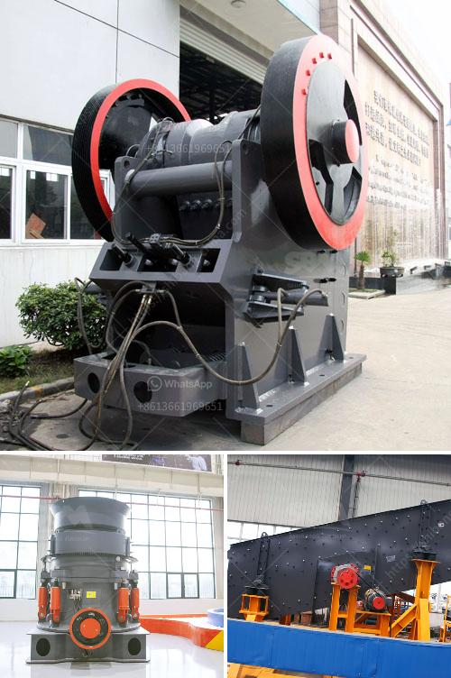

<h3>sand and gravel mining equipment for sale</h3>
Sand and gravel mining equipment are essential tools needed to process these materials efficiently. They are utilized in a variety of industries such as construction, mining, and landscaping. The high demand for sand and gravel makes these resources essential for many projects. As a result, the sale of sand and gravel mining equipment is becoming increasingly prevalent.

One of the main types of equipment used in sand and gravel mining is dredging equipment. Dredgers are used to extract sand and gravel from rivers, lakes, and other bodies of water. They are ideal for mining large quantities of these materials and can remove layers of sediment to reach the desired depth. Dredgers come in various sizes and designs, such as bucket dredgers, suction dredgers, and hydraulic dredgers. Each type has its own advantages and is used depending on the specific requirements of the mining operation.

In addition to dredgers, other essential equipment for sand and gravel mining includes crushers, screens, and conveyors. Crushers are used to break down large rocks into smaller, more manageable sizes. These machines come in different configurations, such as jaw crushers, impact crushers, and cone crushers. Screens are used to separate different sizes of sand and gravel, ensuring that the final product meets the desired specifications. Conveyors are used to transport the mined materials from one location to another, improving the efficiency of the mining process.

Another important piece of equipment used in sand and gravel mining is the washing plant. The washing plant is responsible for cleaning and removing impurities from the extracted materials. It uses water, screens, and various other techniques to separate unwanted particles from the sand and gravel. This ensures that the final product is of high quality and suitable for use in various applications.

When considering the purchase of sand and gravel mining equipment, it is essential to choose machines that are reliable, efficient, and durable. Investing in high-quality equipment will help ensure smoother operations, increase productivity, and minimize downtime. Furthermore, it is important to consider the specific requirements of the mining operation, such as the desired output capacity and the type of materials being mined. By understanding these factors, one can choose equipment that best suits their needs and maximizes profitability.

In conclusion, the sale of sand and gravel mining equipment is on the rise due to the increasing demand for these resources. Dredgers, crushers, screens, conveyors, and washing plants are the key types of equipment used in sand and gravel mining. Investing in high-quality equipment will lead to efficient operations and increased productivity. Consideration of specific requirements is crucial when selecting the equipment to maximize profitability.
<h3>Contact us</h3><ul><li><strong>Whatsapp:&nbsp;<a href="https://wa.me/8613661969651">+8613661969651</a></strong></li><li><a href="https://swt.shibang-china.com/?git&amp;zhl&amp;sand and gravel mining equipment for sale"><strong>Online Service(chat now)</strong></a></li></ul><h3>Related</h3><ul><li><a href='malaysia raymond mill.md'>malaysia raymond mill</a></li><li><a href='prices by hammer mills.md'>prices by hammer mills</a></li><li><a href='used floor grinding machines for sale.md'>used floor grinding machines for sale</a></li><li><a href='vertical ball grinding mills.md'>vertical ball grinding mills</a></li><li><a href='feasibility study of cement plant project pdf.md'>feasibility study of cement plant project pdf</a></li></ul>