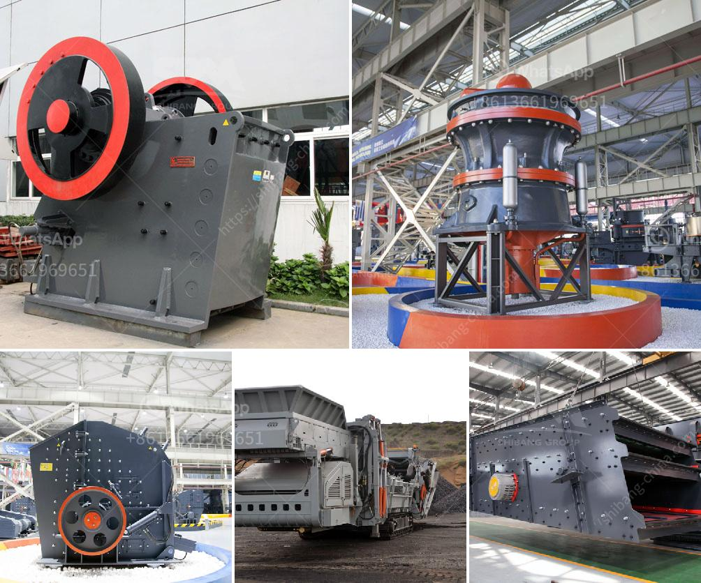

<h3>sand crusher company in nigeria</h3>
Located in Nigeria, Sand Crusher Company is a prominent player in the country's mining industry. The company specializes in the production of high-grade sand products such as concrete, asphalt, and plaster sand. Over the years, Sand Crusher Company has grown from a single plant operation to multiple plants spread across the country.

One of the key factors contributing to the success of this company is its commitment to quality. Sand Crusher Company uses advanced technology and state-of-the-art equipment to ensure that its products meet the highest quality standards. The company has a dedicated quality control team that conducts regular tests and inspections to ensure that every batch of sand produced is of superior quality.

In addition to quality, Sand Crusher Company also prioritizes sustainability. The company has implemented various measures to minimize its environmental impact. It aims to reduce water consumption, improve energy efficiency, and promote responsible mining practices. By investing in sustainable solutions, Sand Crusher Company demonstrates its dedication to preserving the environment for future generations.

Furthermore, Sand Crusher Company is known for its excellent customer service. The company understands the importance of building strong relationships with its clients and works tirelessly to exceed their expectations. It provides timely delivery, competitive pricing, and personalized solutions to meet the diverse needs of its customers. The company's customer-centric approach has earned it a loyal customer base who continue to rely on its products and services.

Sand Crusher Company is also committed to the well-being of its employees. The company provides a safe working environment and encourages professional development through training and career advancement opportunities. By empowering its employees, Sand Crusher Company ensures that they are equipped with the skills and knowledge to contribute to the company's growth and success.

As a part of its corporate social responsibility initiatives, Sand Crusher Company actively engages with local communities. The company sponsors educational programs, supports healthcare facilities, and contributes to infrastructure development in the areas where it operates. By giving back to society, Sand Crusher Company demonstrates its commitment to being a responsible corporate citizen.

Looking ahead, Sand Crusher Company plans to further expand its operations and continue its growth trajectory. The company aims to leverage new technologies and innovation to enhance its production capabilities and offer a wider range of sand products to its customers. Additionally, it plans to explore new markets and expand its reach beyond Nigeria.

In conclusion, Sand Crusher Company is an industry leader in Nigeria's mining sector. With its commitment to quality, sustainability, customer service, and employee well-being, the company has established itself as a trusted name in the industry. Through its corporate social responsibility initiatives, Sand Crusher Company also plays a vital role in the development and upliftment of local communities. With its ambitious expansion plans, the company is poised for further success in the near future.
<h3>Contact us</h3><ul><li><strong>Whatsapp:&nbsp;<a href="https://wa.me/8613661969651">+8613661969651</a></strong></li><li><a href="https://swt.shibang-china.com/?git&amp;zhl&amp;sand crusher company in nigeria"><strong>Online Service(chat now)</strong></a></li></ul><h3>Related</h3><ul><li><a href='hammer mill technical specification.md'>hammer mill technical specification</a></li><li><a href='bazer stone crusher.md'>bazer stone crusher</a></li><li><a href='gold ore processing equipment in south africa.md'>gold ore processing equipment in south africa</a></li><li><a href='vertical mill for.md'>vertical mill for</a></li><li><a href='marble mining countries.md'>marble mining countries</a></li></ul>