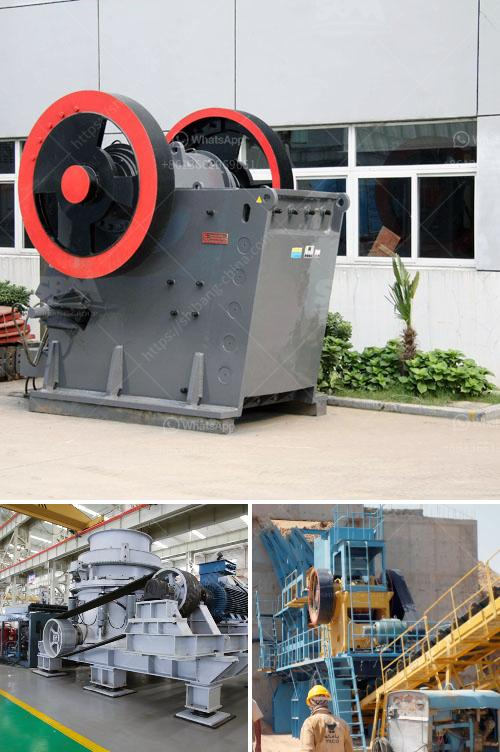

<h3>sand crusher cost</h3>
The sand crusher, also known as the impact crusher, is a widely used sand making machine, receiving extensive attention from customers.

The cost of purchasing and installing a sand crusher varies widely. The price of the impact crusher is determined by many factors, such as the manufacturer's production strength, the scale of the equipment, the quality and performance of the equipment, and the type of technology used. These factors contribute to the difference in price between different models and manufacturers.

In general, the price of a sand crusher ranges from thousands to hundreds of thousands of dollars. The price of a sand crusher with a small output capacity is generally lower, while that of a large-capacity sand crusher is higher. Similarly, equipment produced by well-known manufacturers with good technology and quality tends to have a higher price.

Besides the purchase cost, operating costs are also an important consideration when investing in a sand crusher. The operating costs of a sand crusher mainly include raw material costs, labor costs, energy consumption, and maintenance costs.

The raw materials used for sand making mainly include natural stones such as river pebbles, granite, and limestone. The cost of raw materials will vary depending on the type of raw materials used and the distance from the mining area to the crushing site. Therefore, it is necessary to choose raw materials reasonably and minimize transportation costs.

The labor cost mainly covers the personnel required for the production, operation, and maintenance of the sand crusher. The labor cost is closely related to the scale of production. Generally, the larger the scale, the more labor required. It is necessary to allocate labor reasonably and improve labor efficiency to reduce labor costs.

The energy consumption of the sand crusher mainly comes from electricity. The power consumption of different models is different. To reduce energy consumption, it is necessary to select sand crusher equipment with high energy efficiency and adopt energy-saving measures during operation.

Regular maintenance and repair of sand crushers are necessary to ensure the normal operation of the equipment and extend its service life. The maintenance costs mainly include maintenance expenses, replacement of vulnerable parts, and repair costs. Regular maintenance can effectively reduce maintenance costs and avoid more significant losses caused by equipment failures.

The above factors determine the cost of investing in a sand crusher. When investing, it is essential to consider the specific production requirements, the nature of the raw materials, and the budgetary considerations. It is recommended to compare and select a sand crusher that provides high-quality equipment, excellent performance, and reasonable prices. Additionally, choose a credible manufacturer that offers comprehensive after-sales service to ensure the stable and efficient operation of the equipment, thus maximizing the return on investment.

In conclusion, the cost of investing in a sand crusher includes purchase cost and operating costs. It is crucial to carefully consider these factors to make a reasonable investment decision, ensuring the long-term profitability and success of the sand production project.
<h3>Contact us</h3><ul><li><strong>Whatsapp:&nbsp;<a href="https://wa.me/8613661969651">+8613661969651</a></strong></li><li><a href="https://swt.shibang-china.com/?git&amp;zhl&amp;sand crusher cost"><strong>Online Service(chat now)</strong></a></li></ul><h3>Related</h3><ul><li><a href='bentonite clay powder process equipment.md'>bentonite clay powder process equipment</a></li><li><a href='quarry machinery manufacturers.md'>quarry machinery manufacturers</a></li><li><a href='malaysia raymond mill.md'>malaysia raymond mill</a></li><li><a href='malaysia conveyor belts.md'>malaysia conveyor belts</a></li><li><a href='raymond mill coal pulverizer.md'>raymond mill coal pulverizer</a></li></ul>