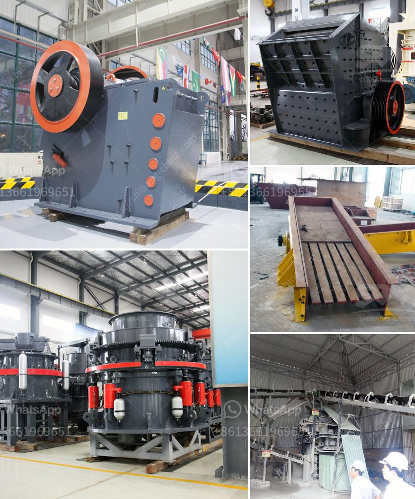

<h3>sand crusher machine</h3>
Sand making machine, also known as vertical shaft impact crusher, is suitable for crushing soft or medium hard and extremely hard ore materials with hardness not higher than 320Pa. The sand making machine is widely used in large, smelting, building materials, highways, railways, water conservancy, and chemical industry and many other sectors. 

With the rapid development of infrastructure projects, the demand for sand and gravel aggregates is increasing. Natural sand is gradually being replaced by machine-made sand. The intensity of human environmental protection is increasing, so the machine-made sand is also favored by the market. The sand making machine is the perfect choice for the sand and gravel aggregate production line. 

In the infrastructure, the development of roads, buildings, dams, tunnels, bridges, etc. requires a lot of sand and gravel aggregates. However, the current production technology of machine-made sand is relatively backward, and the quality of the produced sand is not guaranteed. Therefore, the demand for sand making machines with higher quality and higher performance is increasing. 

The sand crushing machine adopts deep cavity type rotor, and the material throughput is increased by about 30%. The material crushing ratio is large and the production efficiency is high. The finished product is cubic, and the needle-like content is extremely low, which is suitable for aggregate shaping, artificial sand making and high-grade highway aggregate production. 

The machine-made sand production line mainly includes a series of crushing equipment such as sand making machine, jaw crusher, impact crusher, cone crusher, etc. The crushing process includes three stages: coarse crushing, medium crushing, and fine crushing. In the process of screening, there is a large proportion of finished products with cubic shapes and particle sizes below 5mm. 

The sand making machine has the characteristics of simple structure, low operation cost, stable operation, high efficiency and energy saving. The impeller is driven by the motor to rotate at high speed, and the materials enter the crushing chamber from the feeding port and are thrown out by the high-speed spinning impeller. The crushed materials impact each other to form a vortex motion between the impeller and the casing, and are repeatedly crushed and ground. 

The sand crusher machine is widely used in mining, smelting, building materials, highway, railway, water conservancy, chemical industry and many other sectors. It is also known as the efficient sand making equipment is designed according to the working principle of the impact crusher. This crushing equipment is ideal for high-grade road surface and hydroelectric power construction projects. 

In addition, the sand crusher machine is an environmentally friendly production equipment, because the stone material used for sand and stone production is obtained through the blasting process, which is consistent with the national requirements for the production of sand and stone materials, and can apply for environmental protection equipment certificate. 

In conclusion, the sand crushing machine, also known as the impact crusher, is a high-efficiency and low-consumption sand crushing equipment, making it the leading role in the artificial sand making industry. It is widely used to process quartz, sandstone, pebble, limestone, basalt and other stones into sand in mining, construction, cement, transportation and other industries. With the continuous development of infrastructure construction, the demand for sand and gravel aggregates will continue to increase, and the sand crusher machine will play a greater role in the sand and gravel aggregate production line.
<h3>Contact us</h3><ul><li><strong>Whatsapp:&nbsp;<a href="https://wa.me/8613661969651">+8613661969651</a></strong></li><li><a href="https://swt.shibang-china.com/?git&amp;zhl&amp;sand crusher machine"><strong>Online Service(chat now)</strong></a></li></ul><h3>Related</h3><ul><li><a href='impact coal crusher.md'>impact coal crusher</a></li><li><a href='gypsum powder production line germany.md'>gypsum powder production line germany</a></li><li><a href='pulverizer for carbon black.md'>pulverizer for carbon black</a></li><li><a href='stone crusher bahan bakar.md'>stone crusher bahan bakar</a></li><li><a href='ton hour coal crusher and screen.md'>ton hour coal crusher and screen</a></li></ul>