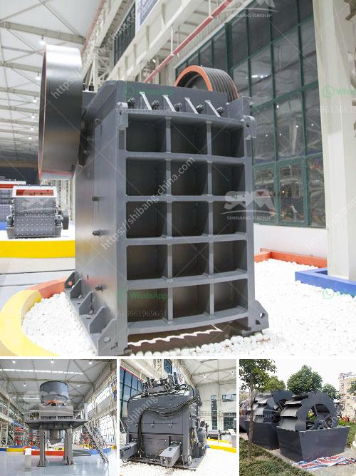

<h3>sand crusher plant</h3>
Sand is an essential component in the construction industry. With ever-increasing demand, it has become crucial to find reliable sources to meet this demand. Fortunately, sand crusher plants have emerged as a viable solution for this problem.

A sand crusher plant is a versatile machine that can produce sand as per your requirements. The sand crusher plant is compact and can be easily transported to any location. They have revolutionized the industry with their numerous advantages such as low fuel consumption, low operating cost, flexible configuration, and easy maintenance.

The sand crusher plant is widely used in industries like construction and road building to crush materials including limestone, granite, basalt, and river stone. The sand crusher plant is an industry leader in producing artificial sand. In India, the sand crusher plant is actively promoted by the Ministry of Environment and Forests (MoEF) as an effective substitute for natural sand.

The sand crusher plant provides a range of crushed sand and aggregate sizes that are perfect for construction projects. The crusher plant produces coarse sand called gravel, fine sand, and superfine sand. Other materials such as pebbles and crushed stones can also be processed.

The sand crusher plant boasts remarkable durability by adopting heavy-duty structure. The overall design ensures stable operation and maximizes resistance to vibrations and impacts. Integrated automation and hollow block making machines streamline the production process and enhance efficiency.

Moreover, the sand crusher plant is eco-friendly and reduces the environmental impact caused by the depletion of natural sand resources. By utilizing waste materials, it minimizes the need for traditional sand extraction. This results in the conservation of natural resources and reduces the carbon footprint caused by transport and extraction operations.

In conclusion, sand crusher plants are efficient and cost-effective solutions for constructing quality sand and gravel. They have quickly gained popularity and are becoming a favored choice in the construction industry. By adapting to the ever-changing requirements of the industry, these plants are poised to play a vital role in meeting the demand for sand.
<h3>Contact us</h3><ul><li><strong>Whatsapp:&nbsp;<a href="https://wa.me/8613661969651">+8613661969651</a></strong></li><li><a href="https://swt.shibang-china.com/?git&amp;zhl&amp;sand crusher plant"><strong>Online Service(chat now)</strong></a></li></ul><h3>Related</h3><ul><li><a href='trommel wash plant suppliers pakistan.md'>trommel wash plant suppliers pakistan</a></li><li><a href='quartz powder making machine in andhra pradesh.md'>quartz powder making machine in andhra pradesh</a></li><li><a href='coal conveyor supplier from india.md'>coal conveyor supplier from india</a></li><li><a href='silica sand grinding machine cost.md'>silica sand grinding machine cost</a></li><li><a href='bauxite mining process.md'>bauxite mining process</a></li></ul>