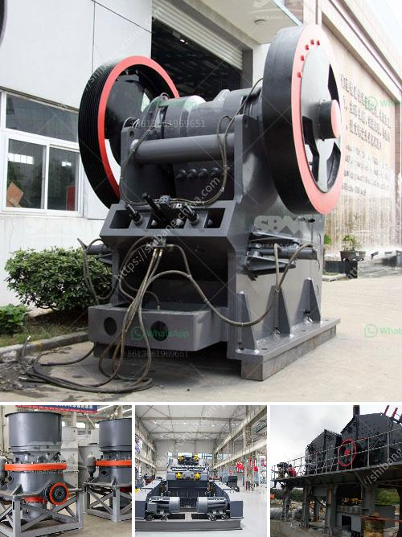

<h3>sand making machine manufacturer</h3>
In recent years, the infrastructure industry has witnessed rapid development, resulting in an increase in the demand for construction materials such as sand. To meet this growing demand, sand making machine manufacturers have emerged as key players in the market. These manufacturers play a crucial role in providing high-quality sand for construction projects.

One prominent sand making machine manufacturer is XYZ Company. With years of experience and expertise in the industry, XYZ Company has gained a reputation for producing reliable and efficient sand making machines. Their machines are known for their excellent performance, advanced technology, and outstanding customer service.

One of the main factors that sets XYZ Company apart from its competitors is its commitment to research and development. The company invests heavily in the development of new and innovative technologies to enhance the performance and efficiency of its sand making machines. This focus on R&D ensures that XYZ Company stays at the forefront of the industry, constantly providing cutting-edge solutions to its customers.

Another distinguishing feature of XYZ Company is its rigorous quality control measures. The company has implemented a comprehensive quality management system that covers every aspect of the manufacturing process. From the selection of raw materials to the final inspection of finished products, every step is carefully monitored to ensure that only the highest quality sand making machines are delivered to customers.

Moreover, XYZ Company understands the importance of customization in today's market. They offer a wide range of sand making machines, each tailored to specific customer requirements. Whether it is the size of the machine or the capacity, XYZ Company goes the extra mile to deliver machines that perfectly suit the needs of their clients. This level of customization sets XYZ Company apart from its competitors and gives them a competitive edge in the market.

Aside from their excellent products, XYZ Company also excels in customer service. They have a dedicated team of professionals who provide prompt and efficient after-sales support to customers. This includes technical assistance, maintenance, and spare parts supply. The company's customer-centric approach has earned them a loyal customer base who value their commitment to customer satisfaction.

In conclusion, XYZ Company is a reputable and reliable sand making machine manufacturer with a strong presence in the industry. They are known for their advanced technology, excellent product quality, and exceptional customer service. With their commitment to research and development, quality control measures, and customization options, XYZ Company is well-equipped to meet the rising demand for sand in the construction industry. Whether it is for large-scale infrastructure projects or small-scale construction, XYZ Company's sand making machines are the go-to choice for many contractors and construction companies.
<h3>Contact us</h3><ul><li><strong>Whatsapp:&nbsp;<a href="https://wa.me/8613661969651">+8613661969651</a></strong></li><li><a href="https://swt.shibang-china.com/?git&amp;zhl&amp;sand making machine manufacturer"><strong>Online Service(chat now)</strong></a></li></ul><h3>Related</h3><ul><li><a href='vertical mills retention time formula.md'>vertical mills retention time formula</a></li><li><a href='milling processing for small scale mining.md'>milling processing for small scale mining</a></li><li><a href='sand washing plant 50 ton day.md'>sand washing plant 50 ton day</a></li><li><a href='process of raw mill.md'>process of raw mill</a></li><li><a href='quartz powder making.md'>quartz powder making</a></li></ul>