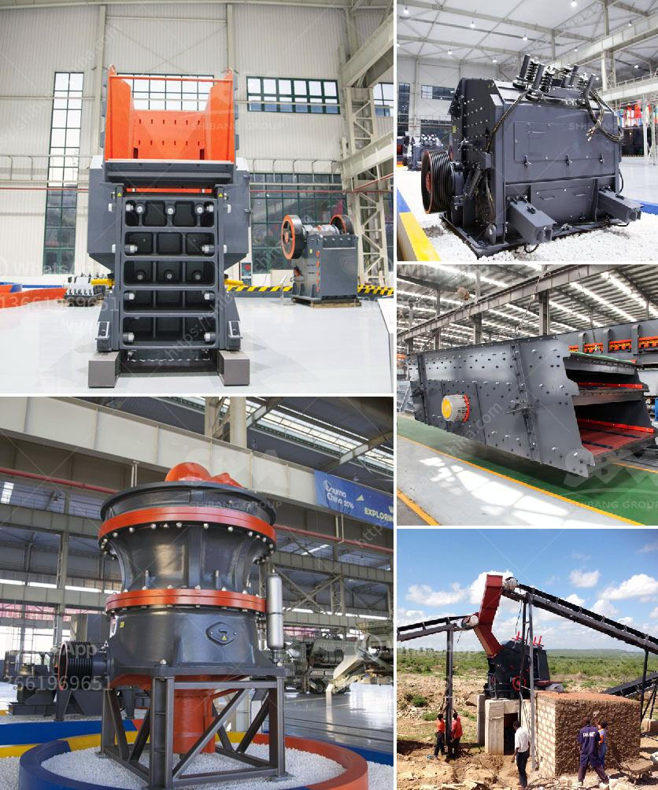

<h3>sand making plant in nepal</h3>
Sand is one of the most widely used natural resources in the world. It plays a vital role in construction, agriculture, and various other industries. However, the increasing demand for sand has led to the depletion of natural resources in many parts of the world. This has prompted the need for alternative solutions, such as sand making plants, to meet the ever-growing demand.

Nepal, a country nestled in the lap of the Himalayas, has also been facing the challenge of sand scarcity. With a booming construction industry and increasing urbanization, the demand for sand has been on the rise. However, the extraction of sand from rivers and other natural sources has resulted in environmental degradation, including the loss of fertile land and the destruction of aquatic habitats.

To address this issue, sand making plants have emerged as a sustainable solution in Nepal. These plants are equipped with advanced technology and machinery to produce artificial sand, also known as manufactured sand or M-sand. Unlike natural sand, which is usually derived from riverbeds, M-sand is produced by crushing hard granite rocks.

One of the key advantages of using M-sand is its consistent quality. The particle size and shape of M-sand can be controlled during the manufacturing process, resulting in sand that is free from impurities and possesses superior strength and durability properties. This makes it ideal for use in construction, especially in high-strength concrete and plastering applications.

Moreover, the production of M-sand conserves natural resources, reduces the need for riverbed sand extraction, and minimizes the environmental impact. It also helps in minimizing the dependence on imported sand, which is expensive and can have quality issues.

The establishment of sand making plants in Nepal has not only helped in ensuring a regular supply of sand but has also generated employment opportunities for the local population. These plants require skilled labor and technicians for their operation and maintenance. Furthermore, the availability of M-sand has also led to cost savings, as it is often cheaper than riverbed sand.

However, it is crucial to ensure that the production of M-sand is carried out in an environmentally sustainable manner. Proper guidelines and regulations must be implemented to prevent illegal sand mining and to promote responsible sand extraction practices. Efforts should also be made to create awareness among the local population about the benefits of using M-sand and to encourage its adoption.

In conclusion, the establishment of sand making plants in Nepal has proved to be a game-changer in the construction industry. It has helped in meeting the growing demand for sand, reduced reliance on riverbed sand extraction, and contributed to environmental sustainability. With proper regulations and awareness, sand making plants can play a significant role in ensuring a steady supply of sand while minimizing the environmental impact.
<h3>Contact us</h3><ul><li><strong>Whatsapp:&nbsp;<a href="https://wa.me/8613661969651">+8613661969651</a></strong></li><li><a href="https://swt.shibang-china.com/?git&amp;zhl&amp;sand making plant in nepal"><strong>Online Service(chat now)</strong></a></li></ul><h3>Related</h3><ul><li><a href='gypsum manufacturing process.md'>gypsum manufacturing process</a></li><li><a href='grinding machine manufacturers ethiopia.md'>grinding machine manufacturers ethiopia</a></li><li><a href='activated carbon plant for sale.md'>activated carbon plant for sale</a></li><li><a href='slag powder grinding in india.md'>slag powder grinding in india</a></li><li><a href='cobble crusher supplier.md'>cobble crusher supplier</a></li></ul>