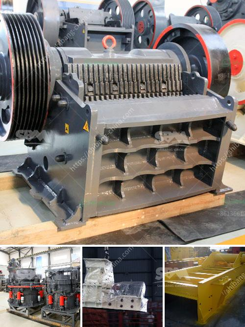

<h3>sand screening machine in malaysia</h3>
Sand screening machine is a common equipment in the production of sand and gravel, which is essential for the construction industry in Malaysia. It is used to remove impurities such as dust and stones from sand, resulting in clean and high-quality sand for various applications. With the rapid development of infrastructure projects in Malaysia, the demand for sand screening machines is growing, and various types of screening machines are available in the market.

Sand screening machines in Malaysia are generally categorized into two types: rotary sand screening machine and vibratory screening machine. Rotary sand screening machine consists of a motor, gearbox, and drum-shaped screen that rotates in a cylindrical motion. It helps to effectively sieve the sand and separate it based on its particle size. On the other hand, vibratory screening machine utilizes a vibratory motor to create vibrations, which help to separate the sand particles based on their sizes.

One of the primary advantages of using a sand screening machine in Malaysia is to eliminate impurities from sand. In construction projects, high-quality sand is crucial as it ensures the strength and durability of concrete structures. By using a sand screening machine, construction companies can ensure that the sand used in their projects is free from any impurities, such as stones and dust, which can weaken the concrete and reduce its lifespan.

Another advantage of using sand screening machines is the improvement of production efficiency. With the help of these machines, the process of sieving sand becomes faster and more efficient compared to manual screening. This not only saves time but also allows construction companies to meet their project deadlines by ensuring a continuous supply of clean sand. Additionally, sand screening machines require minimal human intervention, reducing the labor costs associated with manually sieving sand.

Furthermore, sand screening machines are highly versatile and can be used in various industries beyond construction. Industries such as mining, agriculture, and recycling also utilize sand screening machines to separate different materials and sizes based on their specifications. These versatile machines can effectively sieve different types of materials, including sand, gravel, coal, and aggregates, making them essential equipment for a wide range of industries.

In conclusion, sand screening machines play a vital role in the construction and other industries in Malaysia. Their primary function is to remove impurities from sand, ensuring high-quality sand for various applications. Sand screening machines not only eliminate impurities but also improve production efficiency and reduce labor costs. The market for sand screening machines in Malaysia is growing due to the increasing demand for high-quality sand in infrastructure projects. Therefore, construction companies and other industries can benefit greatly from employing sand screening machines to meet their specific needs, ensuring clean and reliable sand for their projects.
<h3>Contact us</h3><ul><li><strong>Whatsapp:&nbsp;<a href="https://wa.me/8613661969651">+8613661969651</a></strong></li><li><a href="https://swt.shibang-china.com/?git&amp;zhl&amp;sand screening machine in malaysia"><strong>Online Service(chat now)</strong></a></li></ul><h3>Related</h3><ul><li><a href='quartz stone crusher.md'>quartz stone crusher</a></li><li><a href='different types of roller milling.md'>different types of roller milling</a></li><li><a href='manufacturing process of cement.md'>manufacturing process of cement</a></li><li><a href='buy quarry crusher machine from turkey.md'>buy quarry crusher machine from turkey</a></li><li><a href='price of stone crusher size.md'>price of stone crusher size</a></li></ul>