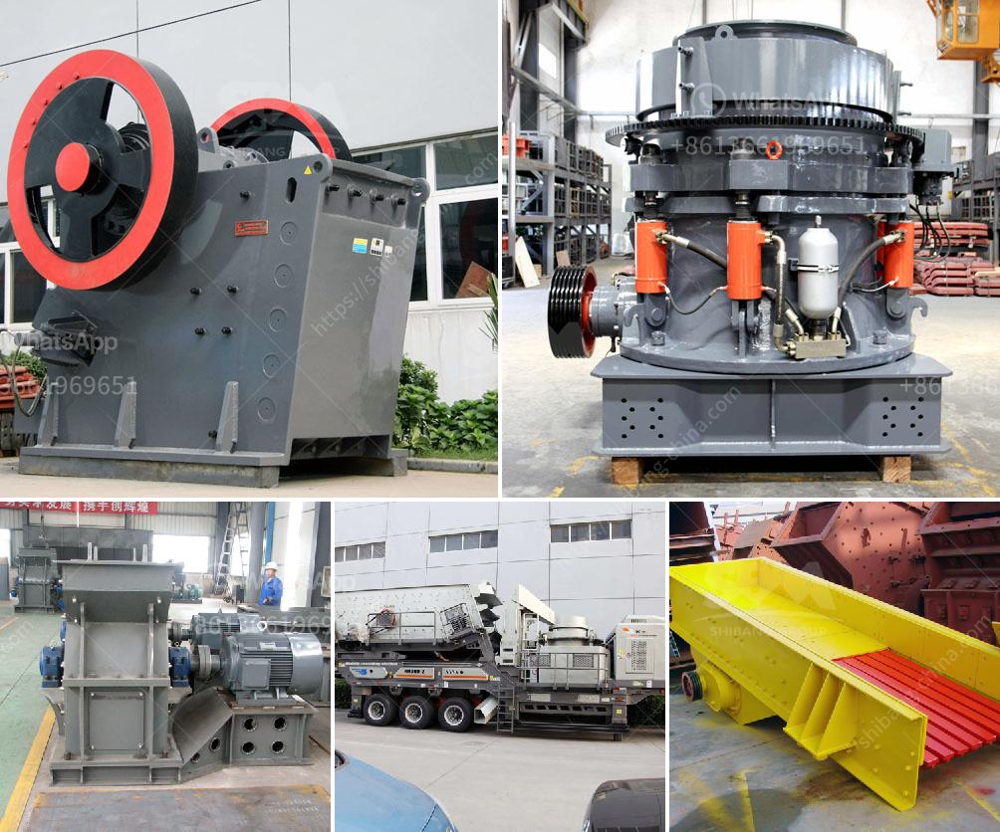

<h3>sand screening mobile washing plants for sale</h3>
Sand screening and washing plants are essential for separating and washing sand from aggregates. Sand screening mobile washing plants are one of the key equipment available for screening washing and dewatering of sand and sand products. These plants are designed to be versatile, efficient, and reliable, making them excellent options for processing various materials such as sand, gravel, and even recycling materials.

The main purpose of sand screening mobile washing plants is to separate sand and aggregates into different sizes, remove impurities such as dust and debris, and wash the sand to obtain a clean and saleable product. This process is crucial in industries such as construction, mining, and recycling, where high-quality sand is required for various applications.

One of the key advantages of mobile washing plants is their mobility and flexibility. These plants are designed to be moved easily from one location to another, allowing operators to set up operations wherever they are needed. This is particularly useful in situations where sand and aggregates need to be processed on-site or in remote areas. Mobile washing plants can be transported by trucks or trailers, making them a convenient solution for construction sites, quarries, and other locations where sand processing is required.

The screening process in mobile washing plants involves using a variety of screens to separate the sand into different sizes. These screens can be interchangeable, allowing operators to adjust the screening process according to their specific requirements. The screens vibrate to help separate the sand particles based on their size, ensuring that the final product is of the desired size and quality.

Once the sand is screened, it is then washed to remove any impurities or foreign materials. The washing process typically involves using water and a combination of mechanical and chemical actions to clean the sand. The water is sprayed onto the sand, which helps to remove dirt, clay, and other impurities. Depending on the specific requirements of the application, additional processes such as scrubbing or attritioning can be added to enhance the cleaning process.

The final step in the sand screening and washing process is dewatering. Dewatering equipment such as hydrocyclones or dewatering screens is used to remove excess water from the washed sand. This helps to achieve a higher quality product with the desired moisture content, making it suitable for various applications such as concrete production, sand blasting, or filter media.

In summary, sand screening mobile washing plants are essential equipment for processing sand and aggregates. They offer versatility, efficiency, and mobility, making them indispensable for industries such as construction, mining, and recycling. These plants can be easily transported and set up in different locations, allowing operators to process sand on-site or in remote areas. With their ability to screen, wash, and dewater sand, these plants ensure the production of high-quality sand for various applications.
<h3>Contact us</h3><ul><li><strong>Whatsapp:&nbsp;<a href="https://wa.me/8613661969651">+8613661969651</a></strong></li><li><a href="https://swt.shibang-china.com/?git&amp;zhl&amp;sand screening mobile washing plants for sale"><strong>Online Service(chat now)</strong></a></li></ul><h3>Related</h3><ul><li><a href='rock crusher machine for sale.md'>rock crusher machine for sale</a></li><li><a href='cement clinker grinding plant cost.md'>cement clinker grinding plant cost</a></li><li><a href='cone crusher uae dealer.md'>cone crusher uae dealer</a></li><li><a href='jaw crusher and cone crusher manufacturers in dubai.md'>jaw crusher and cone crusher manufacturers in dubai</a></li><li><a href='mobile aggregates washing plant.md'>mobile aggregates washing plant</a></li></ul>