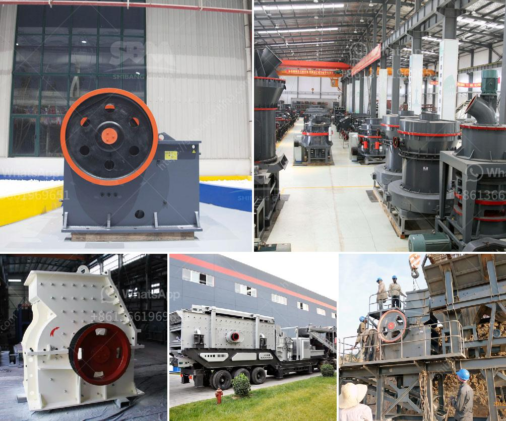

<h3>sand washing equipment</h3>
Beaches are known for their pristine beauty, glistening sand, and crystal clear waters. However, the reality is that these idyllic natural wonders are under constant pressure from pollution, waste, and erosion. One of the major contributors to this degradation is the presence of microplastics and other pollutants in the sand.

Thankfully, technology has come to the rescue with efficient sand washing equipment that is specifically designed to remove these contaminants and restore the beach to its former glory. In this article, we will delve deeper into the importance of sand washing equipment, its functionality, and its benefits.

Sand washing equipment is a mechanical device used to remove impurities such as mud, dust, and other unwanted particles from sand. It plays a crucial role in maintaining the cleanliness and quality of beach sand. With the help of this equipment, beaches can be transformed from polluted and unattractive areas into pristine, inviting spaces that are not only aesthetically pleasing but also safe for both humans and marine life.

The functionality of sand washing equipment is relatively simple. It typically consists of a vibrating feeder, a bucket wheel or spiral sand washing machine, dewatering screen, and other supporting equipment. The vibrating feeder feeds the raw sand into the sand washing machine, which then removes the impurities through a process of agitation and friction. The cleaned sand is then sent to a dewatering screen, where excess water is separated and drained, leaving behind clean and dry sand.

The benefits of using sand washing equipment are numerous. Firstly, it removes harmful pollutants such as microplastics, oil residues, and chemicals, ensuring that the sand is safe for both humans and marine life. Secondly, it helps to prevent erosion by maintaining the stability of the beach. By removing excess debris and smoothing out the sand, it reduces the likelihood of erosion caused by wind and waves.

Furthermore, sand washing equipment is an environmentally friendly solution to beach pollution. By removing pollutants from the sand, it prevents these contaminants from leaching into the surrounding soil and water bodies, thereby safeguarding the entire coastal ecosystem. It also contributes to the overall health and well-being of the marine environment by reducing the accumulation of harmful substances in the sand, which can be ingested by marine organisms.

Additionally, sand washing equipment is a cost-effective solution for beach maintenance. Regular cleaning and maintenance of beaches are essential for tourism, as well as for the overall welfare of coastal communities. By using this equipment, the need for manual cleaning and labor-intensive processes is significantly reduced, saving both time and resources.

In conclusion, sand washing equipment is a crucial tool in the fight against beach pollution and erosion. Whether it is microplastics, oil residues, or other harmful contaminants, this technology is capable of tackling them all. With its environmentally friendly and cost-effective approach, sand washing equipment offers a sustainable solution for maintaining cleaner and healthier beaches. By investing in this technology, we can ensure that future generations will continue to enjoy the natural wonders of our coastlines.
<h3>Contact us</h3><ul><li><strong>Whatsapp:&nbsp;<a href="https://wa.me/8613661969651">+8613661969651</a></strong></li><li><a href="https://swt.shibang-china.com/?git&amp;zhl&amp;sand washing equipment"><strong>Online Service(chat now)</strong></a></li></ul><h3>Related</h3><ul><li><a href='mobile quarry crusher euipment.md'>mobile quarry crusher euipment</a></li><li><a href='dolomite beater mill crusher.md'>dolomite beater mill crusher</a></li><li><a href='grinding machine manufacturers ethiopia.md'>grinding machine manufacturers ethiopia</a></li><li><a href='basalt powder machine supplier uk.md'>basalt powder machine supplier uk</a></li><li><a href='cost of setting up quarry plant in nigeria.md'>cost of setting up quarry plant in nigeria</a></li></ul>