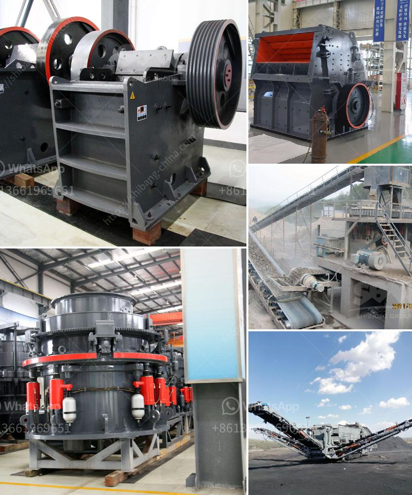

<h3>sand washing machine price</h3>
Sand washing machine is commonly used in sand production line equipment, and its main function is to clean the sand, sludge, and the removal of impurities, a high degree of cleaning sand washing machine, large capacity. The market demand and increasingly high-quality sand and gravel aggregate now, so sand washing machine role has become increasingly important, as many customer choice. According to the specific requirements of the production requirements, the degree of cleaning is required to achieve different standards of sand washing machine equipment prices will be different.

There are many factors affecting the price of sand washing machines, including the model, specifications, and configuration. Different models and specifications have different processing capacities, corresponding to different prices. Generally speaking, the larger the washing machine model, the higher the price, but the efficiency will also be higher. In addition, the configuration of the sand washing machine also affects the price. The more advanced the technology and the more complete the functions, the higher the price. Therefore, when purchasing sand washing machines, customers need to consider their actual production needs and budget, and choose equipment with reasonable prices and suitable configurations.

The external factors that affect the price of sand washing machines are also very important. For example, the fluctuation of raw material prices will affect the overall manufacturing cost of the sand washing machine. In addition, changes in labor costs, transportation costs, and market supply and demand will also have a certain impact on the price. Therefore, when purchasing sand washing machines, customers need to consider these external factors and choose the right time to purchase in order to obtain a more favorable price.

In general, the price range of sand washing machines on the market is relatively wide. There are low-priced equipment and high-priced equipment. The quality and performance of the equipment are also different. When purchasing, it is necessary to comprehensively consider the price, quality, and after-sales service. Choose the equipment that suits you. It is recommended that customers choose well-known and reliable manufacturers to purchase, so as to ensure the quality of the equipment and have better after-sales service guarantee.

In conclusion, the price of sand washing machines varies depending on the model, specifications, and configuration. Customers should consider their production needs and budget when purchasing, and comprehensively consider various factors such as the price, quality, and after-sales service of the equipment. Choose a sand washing machine that meets your needs and purchase from a reliable manufacturer to ensure the quality of the equipment and after-sales service. By doing so, customers can effectively improve the cleaning efficiency of the sand, ensure the quality of the sand and gravel aggregate, and improve the economic benefits of the production line.
<h3>Contact us</h3><ul><li><strong>Whatsapp:&nbsp;<a href="https://wa.me/8613661969651">+8613661969651</a></strong></li><li><a href="https://swt.shibang-china.com/?git&amp;zhl&amp;sand washing machine price"><strong>Online Service(chat now)</strong></a></li></ul><h3>Related</h3><ul><li><a href='roller mill machine for mining.md'>roller mill machine for mining</a></li><li><a href='gold mining equipment manufacturers.md'>gold mining equipment manufacturers</a></li><li><a href='stone crusher to diessel.md'>stone crusher to diessel</a></li><li><a href='top crusher manufacturer.md'>top crusher manufacturer</a></li><li><a href='coal crushing plant.md'>coal crushing plant</a></li></ul>