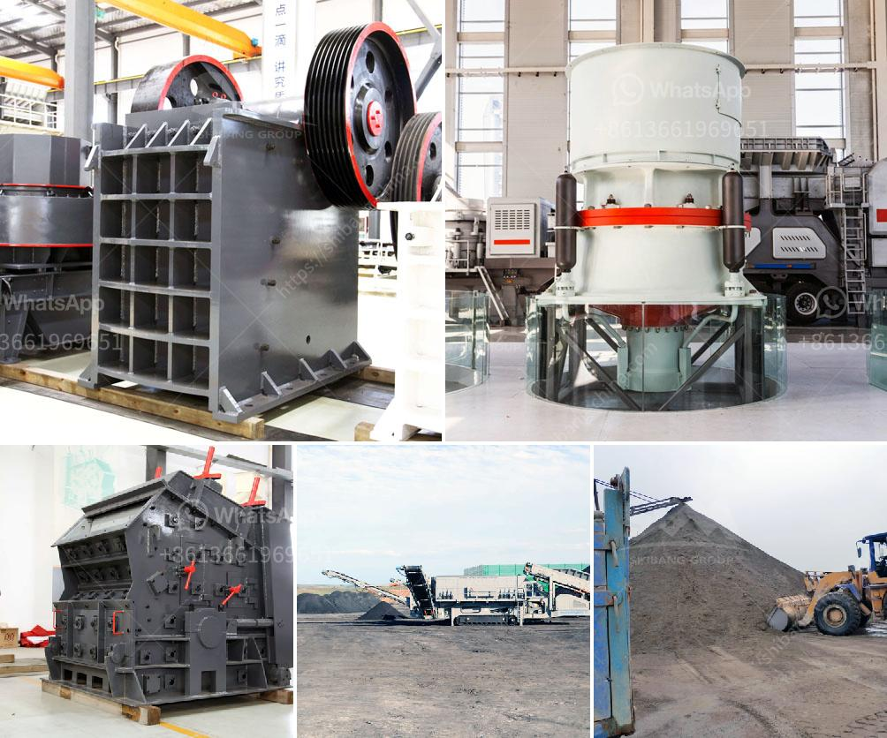

<h3>sand washing plant 50 ton day</h3>
A sand washing plant is designed to remove impurities from sand, such as clay and organic particles. It consists of a series of process steps, including washing, screening, dewatering, and fines recovery. The sand washing plant typically has a capacity of 50 tons per day, with an efficient sand washing rate of 80%.

One of the key components of the sand washing plant is the sand washing machine. It is a highly efficient and reliable machine that cleans, separates, and dewater the sand by using different sieves. The machine works by using water and agitation to break down the sand and remove impurities such as clay, silt, and gravel. The clean sand is then transported to a collection tank or storage area, while the wastewater containing the impurities is sent to a settling pond for further treatment.

The sand washing plant also includes a screening unit, which is responsible for separating the sand into different particle sizes. This is achieved by using various sizes of screens with different size openings. The oversized particles are removed and sent back to the sand washing machine for further treatment, while the properly sized sand is discharged for storage or sale.

In addition to washing and screening, the sand washing plant also incorporates a dewatering unit. This unit uses a high-speed vibrating screen to remove excess water from the sand, reducing the moisture content and improving the quality of the final product. The dewatered sand is then transported to a storage area or used in various construction applications.

Another important component of the sand washing plant is the fines recovery unit. This unit is responsible for recovering the valuable fines that are lost during the washing and screening process. These fines, usually consisting of fine sand particles and spirals, are removed from the wastewater using a dewatering screen or a centrifuge. The recovered fines can then be reused in the production process or sold as a separate product.

The sand washing plant not only ensures the production of clean and high-quality sand but also reduces the environmental impact. By removing impurities and recycling water, it minimizes the demand for freshwater resources and reduces the discharge of wastewater. This contributes to a more sustainable and eco-friendly operation.

In conclusion, a sand washing plant with a capacity of 50 tons per day is an efficient and cost-effective solution for cleaning and processing sand. With advanced technology and equipment, it can remove impurities, separate different particle sizes, dewater the sand, and recover valuable fines. By implementing such a plant, industries can not only improve the quality of their sand products but also reduce their environmental footprint.
<h3>Contact us</h3><ul><li><strong>Whatsapp:&nbsp;<a href="https://wa.me/8613661969651">+8613661969651</a></strong></li><li><a href="https://swt.shibang-china.com/?git&amp;zhl&amp;sand washing plant 50 ton day"><strong>Online Service(chat now)</strong></a></li></ul><h3>Related</h3><ul><li><a href='gold crushers sale.md'>gold crushers sale</a></li><li><a href='gypsum plant unit and utilities.md'>gypsum plant unit and utilities</a></li><li><a href='ball mills in solidwork.md'>ball mills in solidwork</a></li><li><a href='spare parts for a jaw crusher.md'>spare parts for a jaw crusher</a></li><li><a href='complete stone crushing plant.md'>complete stone crushing plant</a></li></ul>