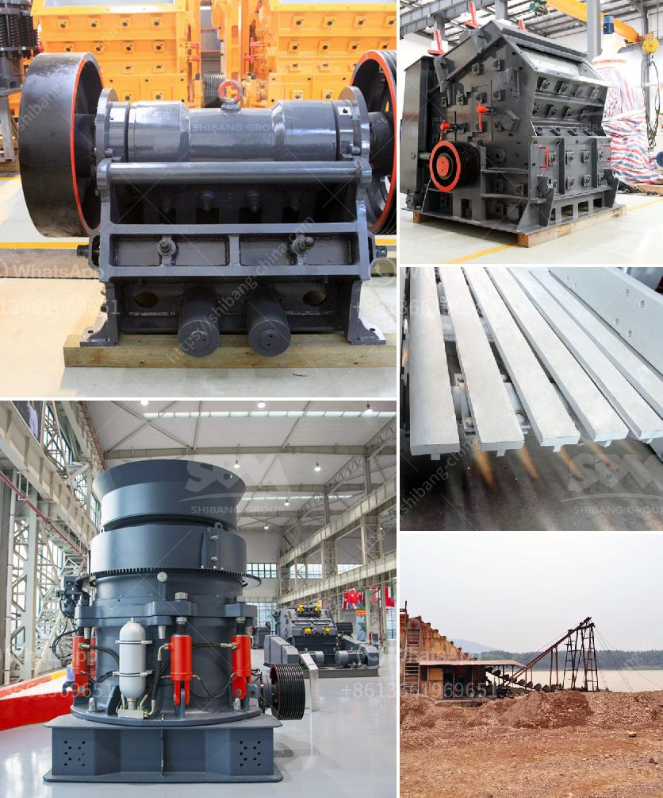

<h3>sand washing plant process</h3>
A sand washing plant is designed to cleanse the sand and improve its quality. Sand washing plants process sand from its raw state to its usable form by combining certain steps such as scrubbing, washing, classifying, and dewatering. The process enables the sand to be used in various applications such as construction, industrial use, and landscaping projects.

The first step in sand washing plant process is the removal of impurities such as clay, silt, and other unwanted particles from the sand. The goal is to make the sand particles more cohesive. Scrubbing can be done manually or with a machine, typically known as a scrubbing machine. Scrubbing machines are designed to break up lumps and remove clay contaminants.

After scrubbing, the sand goes through the washing process. Here, water is added to the sand, creating a slurry-like mixture. The sand and water mixture is then stirred vigorously, allowing the sand particles to separate from any remaining impurities. This washing process helps to remove any remaining organic matter, such as algae or plant debris, as well as any fine particles that were not removed during scrubbing.

Once the washing process is complete, the sand is further classified. The purpose of classification is to separate the sand into different sizes, as different applications may require different sized sand particles. This can be done using a vibrating screen or a cyclone. A vibrating screen separates the sand based on particle size, while a cyclone uses centrifugal force to separate the sand from smaller particles.

After classification, the sand is dewatered to remove excess water. Excess water can reduce the strength and quality of the sand, so dewatering is an important step in the sand washing plant process. This is typically accomplished using a dewatering screen, which removes moisture from the sand by using vibration and gravity.

The final step in the sand washing plant process is drying. Drying is done to remove excess moisture from the sand, ensuring it is ready for use. There are various methods available for drying sand, including the use of hot air or heat lamps. The chosen method will depend on the specific requirements and resources available.

In conclusion, a sand washing plant process involves several steps to transform raw sand into usable sand. These steps include scrubbing, washing, classification, dewatering, and drying. Each step is essential in removing impurities and improving the quality of the sand. By undergoing this process, the sand can be used in various applications, contributing to numerous construction, industrial, and landscaping projects.
<h3>Contact us</h3><ul><li><strong>Whatsapp:&nbsp;<a href="https://wa.me/8613661969651">+8613661969651</a></strong></li><li><a href="https://swt.shibang-china.com/?git&amp;zhl&amp;sand washing plant process"><strong>Online Service(chat now)</strong></a></li></ul><h3>Related</h3><ul><li><a href='stone paper production machine.md'>stone paper production machine</a></li><li><a href='baxter stone crusher in uk.md'>baxter stone crusher in uk</a></li><li><a href='sand crusher machine.md'>sand crusher machine</a></li><li><a href='stone crushing machines for sale.md'>stone crushing machines for sale</a></li><li><a href='mobile crushers stone in south africa.md'>mobile crushers stone in south africa</a></li></ul>