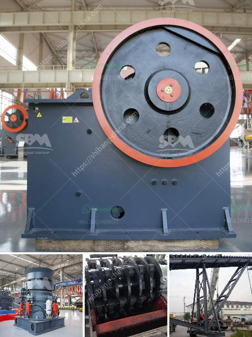

<h3>sand washing process</h3>
Sand washing is the process of removing dirt, dust, and other contaminants from sand to produce high-quality sand for use in various construction and industrial applications. The washing process involves using water, chemicals, and mechanical methods to remove impurities and improve sand quality.

The first step in the sand washing process is to remove the big rocks and debris from the sand. This is done using a vibrating screen or a sand cyclone, which works on the principle of gravity separation. The sand and water mixture is fed into the vibrating screen or cyclone, where the heavy rocks and debris settle at the bottom, and the clean sand is pushed up and discharged.

Once the initial impurities are removed, the next step is to wash the sand to remove any remaining dirt, dust, or organic matter. This is usually achieved using water and various chemicals in a washing tank or sand screw. The sand is first fed into the tank or screw, and water is added to create a slurry. The solution containing the sand and water is then agitated to separate the impurities from the sand particles. Chemicals such as flocculants or coagulants may be added to enhance the separation process.

During the washing process, the sand particles are also scrubbed to remove any stubborn dirt or organic matter that may be sticking to the surface. This is done using paddles or brushes that agitate the sand particles and dislodge any contaminants. The scrubbing action, combined with the flow of water, helps to remove even the smallest impurities from the sand.

After the washing and scrubbing process, the clean sand is then dewatered to remove excess moisture. This is usually done using a dewatering screen, centrifuge, or sand screw. These equipment work by applying centrifugal forces to separate water from the sand particles. The dewatered sand is then discharged and can be further processed or used immediately, depending on its intended application.

The sand washing process has several advantages. Firstly, it reduces the content of impurities in the sand, making it suitable for use in various construction and industrial applications. Clean sand is essential in producing high-quality concrete, asphalt, glass, and other products. Secondly, washing the sand helps to improve its grain size distribution, which enhances its workability and strength. Properly sized sand particles provide better consistency and stability in construction materials.

Furthermore, the washing process helps to reduce environmental pollution. By removing dirt, dust, and organic matter from the sand, the washing process prevents these contaminants from being released into the environment. This is particularly important for sand extracted from rivers or other natural sources, as it helps to protect ecosystems and maintain biodiversity.

In conclusion, sand washing is a crucial process in the production of high-quality sand for construction and industrial applications. It involves removing impurities, washing the sand to remove dirt and organic matter, and dewatering the sand to remove excess moisture. The process improves sand quality, enhances workability, and minimizes environmental pollution. By implementing effective sand washing techniques, we can ensure the production of clean and reliable sand for various industries.
<h3>Contact us</h3><ul><li><strong>Whatsapp:&nbsp;<a href="https://wa.me/8613661969651">+8613661969651</a></strong></li><li><a href="https://swt.shibang-china.com/?git&amp;zhl&amp;sand washing process"><strong>Online Service(chat now)</strong></a></li></ul><h3>Related</h3><ul><li><a href='stone crusher capsule.md'>stone crusher capsule</a></li><li><a href='dolomite powder plant.md'>dolomite powder plant</a></li><li><a href='hammer mill technical.md'>hammer mill technical</a></li><li><a href='chinese aggregate crusher suppliers.md'>chinese aggregate crusher suppliers</a></li><li><a href='raymond mill grinding.md'>raymond mill grinding</a></li></ul>