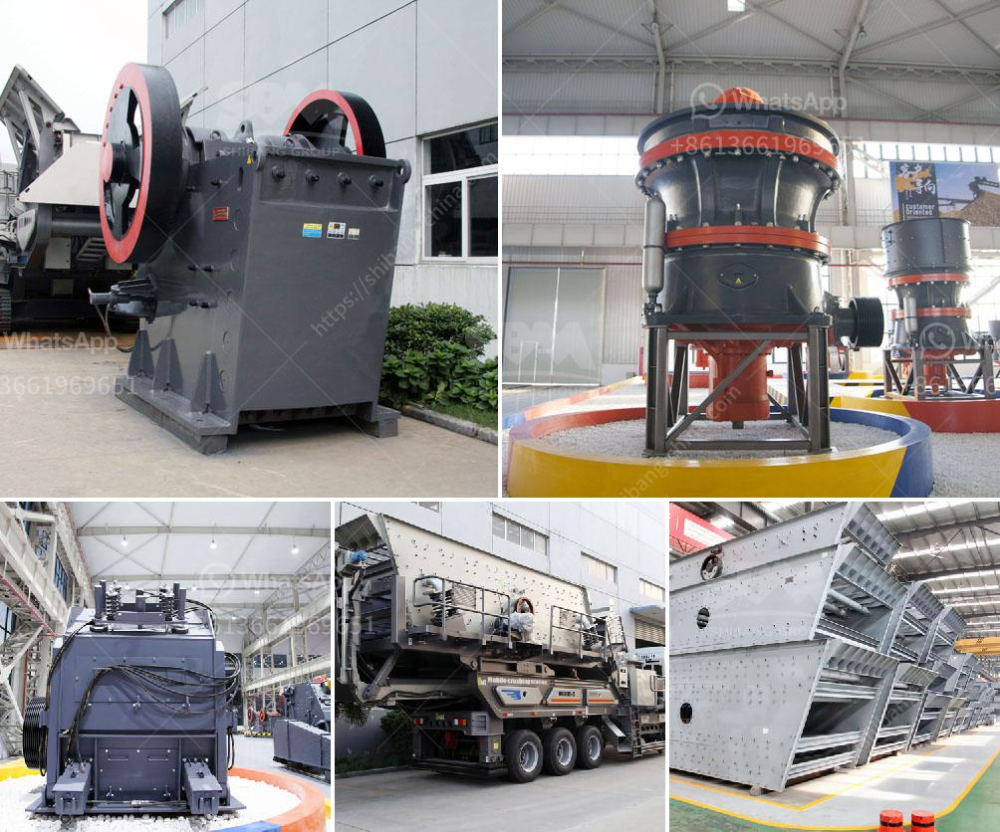

<h3>sand washing screening machine</h3>
Sand washing screening machine is designed for washing, screening and dewatering sand materials, as well as fine-grained and coarse-grained materials. It is widely used in the aggregate and mining industries.

When working, the machine uses the kinetic energy generated by the motor to drive the impeller to rotate at a high speed. The sand and water mixture enters the cleaning tank through the feeding trough and is stirred by the impeller, thereby removing impurities and separating washing sand. After being washed, the clean sand is brought out by the impeller and discharged into the discharge trough. The impurities are discharged through the overflow weir and washed away by water.

The sand washing screening machine has several advantages. Firstly, it has a high cleaning rate. The impeller and the screen are easy to wear parts. With the long-life manganese steel screen cloth, the machine can have a higher cleaning efficiency, thus reducing the loss of fine sand. Secondly, the machine has a large processing capacity. It is equipped with a circular arc-shaped screen cloth, which has a large effective screening area. This design can effectively increase the sand screening rate and improve the output of the machine.

Furthermore, the sand washing screening machine has a wide range of applications. It can be used for the washing and screening of various materials, such as sand, aggregate, coal, ore, etc. The machine is particularly suitable for the washing of sand used in construction sites and quarries. By removing impurities and grading the sand, it can meet the requirements of various construction projects.

In addition, the sand washing screening machine is environmentally friendly. It uses water as the medium for washing, so it does not pollute the environment. Moreover, the machine is equipped with a water-saving device, which can effectively save water during operation, reducing water consumption and conserving resources. This makes it a more sustainable option in the mining and construction industries.

When choosing a sand washing screening machine, there are several factors to consider. Firstly, the quality of the machine is crucial. It is important to choose a machine made of high-quality materials, as it ensures the durability and long service life of the machine. Secondly, the size and capacity of the machine should match the production needs. It is necessary to select a machine with the appropriate size and processing capacity to improve work efficiency.

In conclusion, the sand washing screening machine plays a vital role in the aggregate and mining industries. With its high cleaning rate, large processing capacity, wide range of applications, and environmental friendliness, it has become an essential equipment in sand washing and screening operations. When choosing a machine, it is important to consider factors such as quality, size, and capacity to ensure optimal performance.
<h3>Contact us</h3><ul><li><strong>Whatsapp:&nbsp;<a href="https://wa.me/8613661969651">+8613661969651</a></strong></li><li><a href="https://swt.shibang-china.com/?git&amp;zhl&amp;sand washing screening machine"><strong>Online Service(chat now)</strong></a></li></ul><h3>Related</h3><ul><li><a href='project cost of mini cement plant in india.md'>project cost of mini cement plant in india</a></li><li><a href='jual stone crusher mobile cap 30 tph in indonesia.md'>jual stone crusher mobile cap 30 tph in indonesia</a></li><li><a href='2nd hand crushers thailand.md'>2nd hand crushers thailand</a></li><li><a href='stone crushing plant project report.md'>stone crushing plant project report</a></li><li><a href='diamond mining machinery prices.md'>diamond mining machinery prices</a></li></ul>