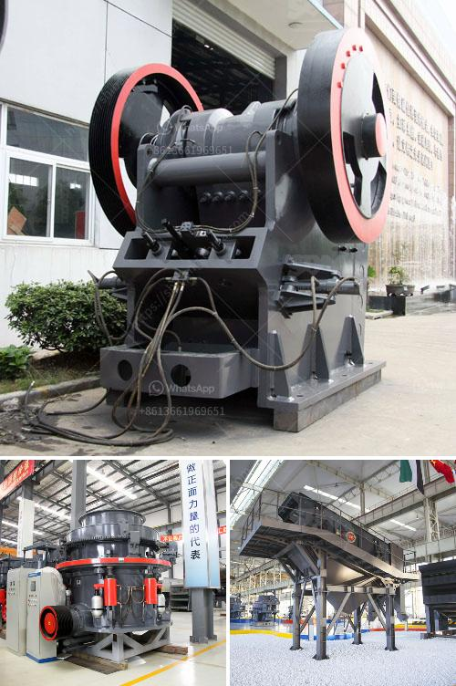

<h3>saudi arabia used conveyor belts price</h3>
Saudi Arabia is a country known for its vast oil reserves and thriving economy. With such thriving industries, including mining and manufacturing, it is no surprise that the demand for conveyor belts is high. Conveyor belts are integral to various industries, facilitating the efficient movement of materials and products. However, one of the primary concerns of businesses is the cost of conveyor belts. In Saudi Arabia, the prices of used conveyor belts vary depending on several factors.

Quality is an essential determinant when it comes to pricing used conveyor belts. If the belt is in good condition and has been well-maintained, its price is likely to be higher. The overall length, width, and type of belt material also play a significant role in determining the price. Generally, longer and wider belts are pricier, as they can handle more material and provide increased efficiency. Moreover, different belt materials are suited for specific industries, such as heavy-duty applications or food processing, leading to variations in price.

In Saudi Arabia, the price range for used conveyor belts typically falls between 100 to 300 Saudi riyals per meter. This range allows businesses of all sizes to find a conveyor belt that suits their budget without compromising on quality. However, it is important to note that these prices are subject to negotiation, especially when purchasing in bulk or establishing a long-term business relationship.

When looking for used conveyor belts in Saudi Arabia, it is advisable to explore both local suppliers and international manufacturers. Local suppliers often provide convenience and quicker delivery times, resulting in lower transportation costs. On the other hand, international manufacturers may offer a wider variety of options and advanced technology, but shipping costs and longer lead times should also be considered.

In conclusion, Saudi Arabia offers a range of prices for used conveyor belts, ranging from 100 to 300 Saudi riyals per meter. Businesses should consider factors such as quality, length, width, and material type when determining the price range suitable for their needs. Exploring both local and international suppliers can help in finding the most cost-effective solution for conveyor belt requirements.
<h3>Contact us</h3><ul><li><strong>Whatsapp:&nbsp;<a href="https://wa.me/8613661969651">+8613661969651</a></strong></li><li><a href="https://swt.shibang-china.com/?git&amp;zhl&amp;saudi arabia used conveyor belts price"><strong>Online Service(chat now)</strong></a></li></ul><h3>Related</h3><ul><li><a href='fly ash powder making.md'>fly ash powder making</a></li><li><a href='cost of setting a sand crushing plant in india.md'>cost of setting a sand crushing plant in india</a></li><li><a href='sample gold processing and mining business plan pdf.md'>sample gold processing and mining business plan pdf</a></li><li><a href='stone crusher plants.md'>stone crusher plants</a></li><li><a href='granite rock sand machinery.md'>granite rock sand machinery</a></li></ul>