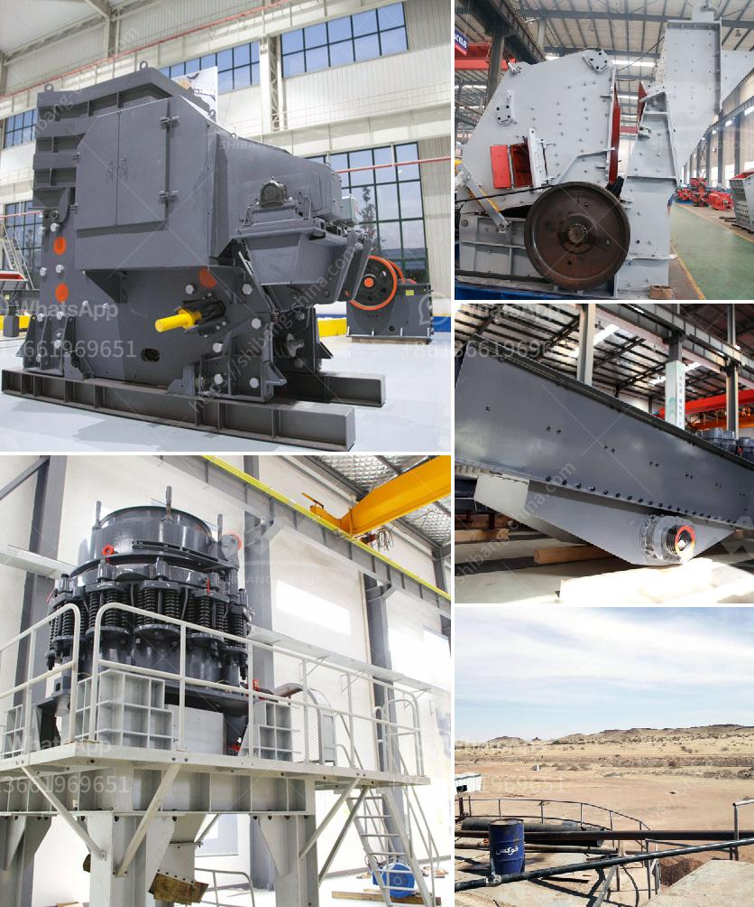

<h3>sayaji stone crushers ahmedabad</h3>
Sayaji Stone Crushers Ahmedabad is a well-known stone crusher manufacturer in Ahmedabad, Gujarat. Established in 1941, it offers a variety of innovative crushing solutions for various industries. These machines are appreciated for their sturdy construction, reliable performance, and long service life. Sayaji has been providing reliable and high-quality crushers for several decades, making it one of the most trusted brands in the industry.

The primary focus of Sayaji Stone Crushers is to cater to the needs of construction, mining, and recycling industries. The crushers are designed to reduce the size of large rocks, ores, and demolition waste into smaller, manageable pieces. With its efficient crushing mechanism, these machines help in producing high-quality aggregates and project materials.

One of the key advantages of Sayaji Stone Crushers is its ability to handle a wide range of materials. From soft limestone to hard granite, these crushers can efficiently process various types of stones with ease. They are designed to handle large volumes of material, making them ideal for high-capacity crushing operations.

Another notable feature of Sayaji Stone Crushers is their user-friendly design. These machines are easy to operate and maintain, making them suitable for both experienced professionals and newcomers in the industry. The crushers are equipped with advanced technology, including hydraulic systems, ensuring smooth and trouble-free operation.

Sayaji Stone Crushers Ahmedabad offers a comprehensive range of crushers, screens, feeders, and conveyors. These machines are available in different models and sizes to suit diverse requirements. Whether it is a small-scale construction project or a large mining operation, Sayaji has the right equipment to handle various tasks efficiently.

In addition to manufacturing high-quality crushers, Sayaji also provides comprehensive after-sales support to its customers. Their team of trained professionals offers installation assistance, regular maintenance services, and timely spare parts supply. This ensures that the crushers are always in optimal condition, minimizing downtime and maximizing productivity.

Customers who have used Sayaji Stone Crushers Ahmedabad have praised the company for its reliable products and excellent customer service. Many have commended the crushers' durability, efficiency, and low maintenance requirements. These positive customer reviews reflect Sayaji's commitment to delivering top-notch products and services.

In conclusion, Sayaji Stone Crushers Ahmedabad is a reliable and trusted provider of stone crushing machines and equipment. These machines have a robust construction, reliable performance, and long service life, making them ideal for various industries. Their user-friendly design, efficient crushing mechanism, and comprehensive after-sales support make them a preferred choice among customers. Sayaji Stone Crushers Ahmedabad continues to set new standards in the crushing industry, ensuring customer satisfaction with its top-quality products and services.
<h3>Contact us</h3><ul><li><strong>Whatsapp:&nbsp;<a href="https://wa.me/8613661969651">+8613661969651</a></strong></li><li><a href="https://swt.shibang-china.com/?git&amp;zhl&amp;sayaji stone crushers ahmedabad"><strong>Online Service(chat now)</strong></a></li></ul><h3>Related</h3><ul><li><a href='large capacity jaw crusher stone crusher quarry machine.md'>large capacity jaw crusher stone crusher quarry machine</a></li><li><a href='enquiry jaw crusher.md'>enquiry jaw crusher</a></li><li><a href='aggregates for concrete crusher in nigeria.md'>aggregates for concrete crusher in nigeria</a></li><li><a href='spare parts cone crushers telesmit cone.md'>spare parts cone crushers telesmit cone</a></li><li><a href='gypsum fertilizer granulator for sale.md'>gypsum fertilizer granulator for sale</a></li></ul>