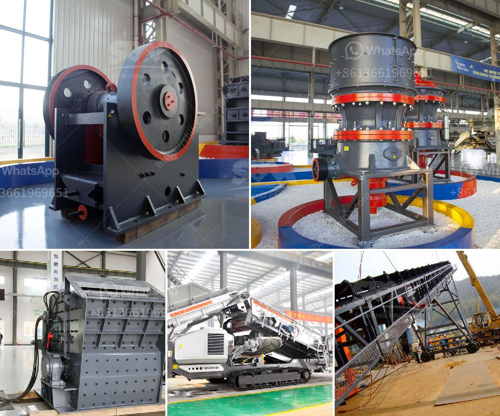

<h3>scale mining equipment for africa sudan market</h3>
The African continent is known for its abundance of natural resources, including minerals. With vast reserves of gold, diamonds, and other highly sought-after minerals, it is no wonder that mining is a significant contributor to the continent's economic growth. However, small-scale mining operations in Africa often face unique challenges due to limited access to modern technology and equipment. In Sudan, one of Africa's top gold-producing countries, the need for efficient and cost-effective scale mining equipment is more crucial than ever.

Small-scale mining, also known as artisanal mining, plays a vital role in job creation and economic development in many African countries. It provides livelihood opportunities for millions of people, particularly in rural and remote areas, where formal employment options are limited. However, this type of mining is often characterized by low productivity, unsafe working conditions, and environmental degradation due to the use of rudimentary tools and outdated machinery.

In Sudan, small-scale gold mining has been a prevalent activity for centuries. The country's central region, known as the "Blue Nile," is renowned for its rich gold deposits. However, the lack of modern mining equipment has hindered the sector's potential to contribute fully to Sudan's economic growth. To address this challenge, there is a pressing need to invest in scale mining equipment tailored to the Sudanese market.

Scale mining equipment suitable for Sudan's market should prioritize affordability, durability, and efficiency. These factors are crucial to ensure that small-scale miners can access technology that improves both their productivity and safety. Additionally, equipment should be adaptable to local conditions, as Sudan's diverse geography presents specific challenges in terms of terrain and climate.

One example of such equipment is the gold shaking table, a gravity concentration device used to separate fine-grained gold from other materials. Compared to traditional methods like panning or sluice boxes, a shaking table offers more efficient gold recovery. It operates by shaking a deck fitted with riffles and a water wash system, allowing gravity to separate gold particles from ore.

Another essential piece of equipment is the gold centrifugal concentrator, which uses centrifugal force to enhance the gravity separation process. Artisanal miners often struggle to recover fine gold particles, which are easily lost during the extraction process. By harnessing centrifugal force, this equipment can capture even the smallest gold particles, increasing overall gold recovery rates.

Furthermore, portable drilling rigs and crushing machines are crucial for small-scale mining operations in Sudan. These tools allow miners to explore, extract, and process ore efficiently. Drilling rigs are used to identify potential mineral deposits, while crushing machines help break down ore into smaller particles for further processing.

To ensure the successful adoption of scale mining equipment in Sudan, policymakers and stakeholders should prioritize capacity building and technical training for small-scale miners. It is essential to equip them with the necessary skills to operate modern equipment safely and efficiently. Additionally, partnerships between governments, mining associations, and equipment manufacturers can facilitate knowledge transfer and technology exchange, supporting the growth of Sudan's small-scale mining sector.

In conclusion, investing in scale mining equipment specifically designed for the Sudanese market is crucial to unlocking the full potential of small-scale gold mining in the country. By improving productivity, safety, and efficiency, modern equipment can support job creation and economic development, contributing to a sustainable future for Sudan's mining industry.
<h3>Contact us</h3><ul><li><strong>Whatsapp:&nbsp;<a href="https://wa.me/8613661969651">+8613661969651</a></strong></li><li><a href="https://swt.shibang-china.com/?git&amp;zhl&amp;scale mining equipment for africa sudan market"><strong>Online Service(chat now)</strong></a></li></ul><h3>Related</h3><ul><li><a href='mobile gold processing plant in russia.md'>mobile gold processing plant in russia</a></li><li><a href='price conveyor belt price.md'>price conveyor belt price</a></li><li><a href='mining conveyor belt china.md'>mining conveyor belt china</a></li><li><a href='ton per hour gold wash plants.md'>ton per hour gold wash plants</a></li><li><a href='mobile crusher discount.md'>mobile crusher discount</a></li></ul>