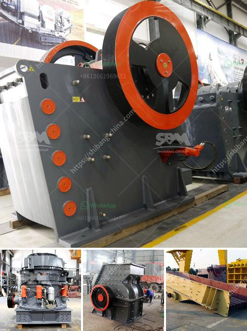

<h3>screening coal crushing plant</h3>
Screening coal crushing plants are widely used in coal mining operations, as an effective way to separate the desired coal particles from unwanted rock and dirt. Mining companies typically invest in screening equipment to extract coal from the ground and process it for commercial use.

The purpose of a coal crushing and screening plant is to separate the coal particles by size and remove impurities such as rocks, dirt, ash, sulfur, and other contaminants. This process improves the quality of the coal and ensures that it meets the requirements for various industrial applications.

The screening process begins with the raw coal being fed into a crusher, which reduces the size of the coal to manageable chunks. From there, the coal is then sent through a series of vibrating screens, where it is separated into different sizes. The screens are designed to allow the smaller coal particles to pass through while retaining larger particles for further crushing or processing.

Screening coal crushing plants often include additional equipment such as magnetic separators, which are used to remove any remaining impurities or metal contaminants from the coal. This ensures that the final product is clean and free of any unwanted substances.

There are several benefits to using screening coal crushing plants. Firstly, the process helps to improve the efficiency of coal mining operations by reducing the amount of waste material that needs to be processed. This results in cost savings for mining companies, as they can extract and process more usable coal from each ton of raw material.

Additionally, screening coal crushing plants help to ensure that the final product meets the required specifications for various industrial applications. The coal can be used in power plants to generate electricity or in manufacturing processes for the production of steel, cement, or other materials.

Overall, screening coal crushing plants play a crucial role in the coal mining industry. They help to extract usable coal from the ground, remove impurities, and ensure that the final product meets the required specifications. By investing in screening equipment, mining companies can improve the efficiency of their operations and produce higher quality coal for various industrial applications.
<h3>Contact us</h3><ul><li><strong>Whatsapp:&nbsp;<a href="https://wa.me/8613661969651">+8613661969651</a></strong></li><li><a href="https://swt.shibang-china.com/?git&amp;zhl&amp;screening coal crushing plant"><strong>Online Service(chat now)</strong></a></li></ul><h3>Related</h3><ul><li><a href='river stone crusher for sale.md'>river stone crusher for sale</a></li><li><a href='tracked mobile screening plant.md'>tracked mobile screening plant</a></li><li><a href='gypsum plant unit and utilities.md'>gypsum plant unit and utilities</a></li><li><a href='high capacity fine stone quarry crusher machine.md'>high capacity fine stone quarry crusher machine</a></li><li><a href='plans for making a miniature jaw crusher.md'>plans for making a miniature jaw crusher</a></li></ul>