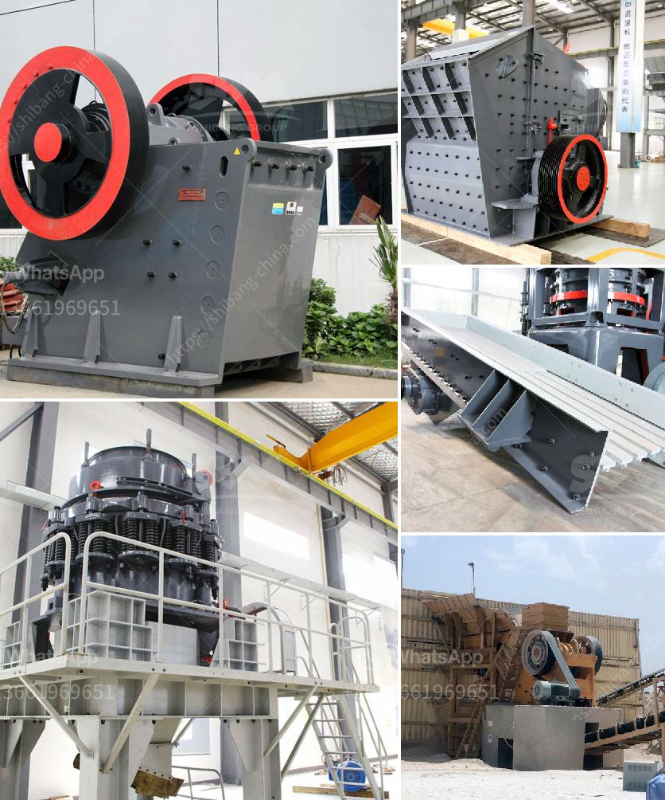

<h3>second hand automatic crusher plant</h3>
Second-hand automatic crusher plants are becoming increasingly popular among businesses that prioritize cost-effectiveness, sustainability, and efficiency. These plants offer a cost-effective alternative for mining and quarrying operations that require substantial crushing capacity. With advancements in technology and improvements in machinery, second-hand automatic crusher plants provide a viable solution for businesses looking to expand their operations without investing heavily in brand new equipment.

One of the main advantages of second-hand automatic crusher plants is their affordability. These plants, previously owned by other businesses before being put up for sale, often come at a significantly lower price compared to buying new equipment. This cost advantage allows businesses to allocate their resources effectively and invest in other areas of their operations. By opting for a second-hand crusher plant, businesses can save a substantial amount of money without compromising on efficiency or productivity.

Besides being cost-effective, second-hand automatic crusher plants also contribute to environmental sustainability. By reusing existing machinery, these plants reduce the demand for new production and limit the need for extracting raw materials. Additionally, the carbon footprint associated with the manufacturing and transportation of new equipment is also reduced. Choosing second-hand options promotes a circular economy by extending the life cycle of machines and reducing waste and environmental impact.

Another key benefit of second-hand automatic crusher plants is the shorter lead time for delivery. Unlike purchasing new equipment, which can often involve lengthy manufacturing and shipping processes, second-hand plants are readily available. This accelerated delivery time allows businesses to swiftly expand their capacity and meet growing demands. By reducing the time between decision-making and implementation, companies can optimize their operations and stay competitive in the market.

However, it is essential to conduct thorough research and due diligence before investing in a second-hand automatic crusher plant. A comprehensive examination of the machine’s condition, maintenance history, and performance records is crucial to avoid potential pitfalls. Engaging with trusted vendors or equipment dealers who provide detailed information about the plant's history and offer warranties can ensure a hassle-free purchase.

Regular preventive maintenance and timely repairs are essential to optimize the performance and longevity of a second-hand automatic crusher plant. This includes routine inspections, lubrication of moving parts, and replacing worn-out components. By adopting a proactive approach to maintenance, businesses can maximize the uptime of their crusher plants and minimize unexpected downtime, ensuring continuous and uninterrupted operations.

In conclusion, second-hand automatic crusher plants offer businesses a cost-effective, sustainable, and efficient solution for expanding their crushing capacity. These plants provide a more affordable alternative to purchasing new equipment, contributing to both cost savings and environmental preservation. With a shorter lead time for delivery, businesses can swiftly implement changes and meet increasing demands. However, thorough research and proper maintenance are crucial to ensure the smooth operation and longevity of the plant. By making informed decisions and investing wisely, businesses can reap the numerous benefits of second-hand automatic crusher plants.
<h3>Contact us</h3><ul><li><strong>Whatsapp:&nbsp;<a href="https://wa.me/8613661969651">+8613661969651</a></strong></li><li><a href="https://swt.shibang-china.com/?git&amp;zhl&amp;second hand automatic crusher plant"><strong>Online Service(chat now)</strong></a></li></ul><h3>Related</h3><ul><li><a href='famous crusher and grinder manufacturer france.md'>famous crusher and grinder manufacturer france</a></li><li><a href='ballast crushing equipment.md'>ballast crushing equipment</a></li><li><a href='hammer crusher dimension.md'>hammer crusher dimension</a></li><li><a href='manufacturing artificial sand in malaysia.md'>manufacturing artificial sand in malaysia</a></li><li><a href='roller crusher for sale gumtree.md'>roller crusher for sale gumtree</a></li></ul>