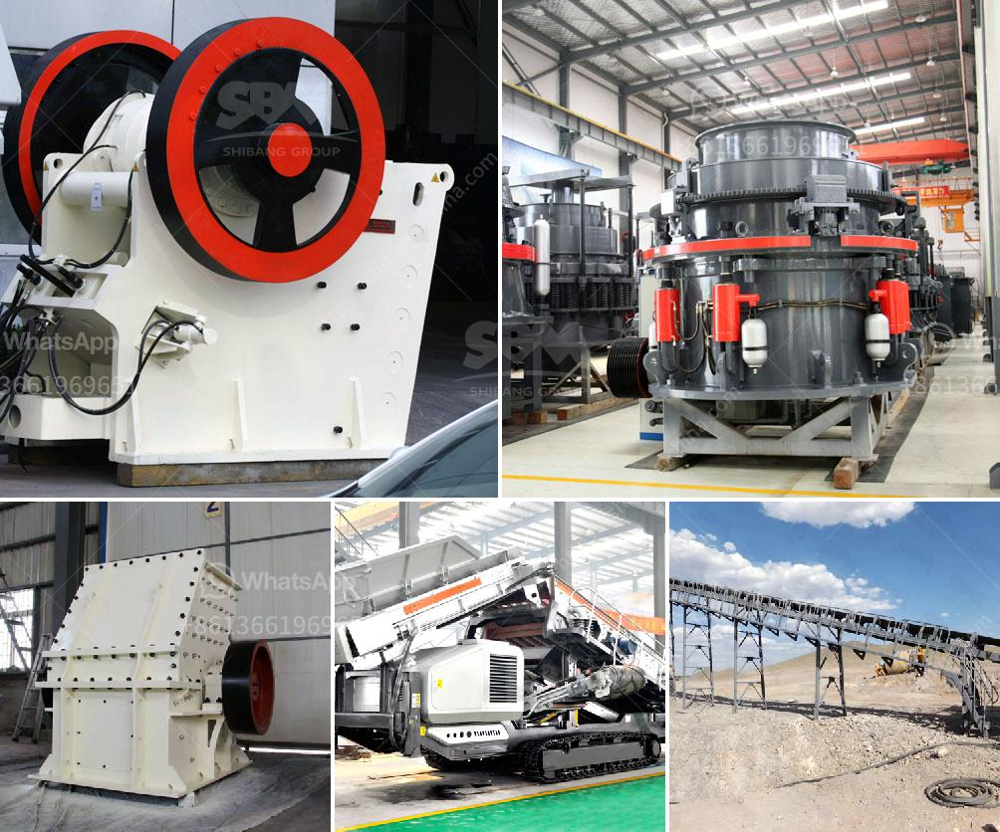

<h3>second hand crusher to buy in zambia</h3>
The demand for second-hand crushers in Zambia is on the rise, as the country continues to develop its infrastructure, particularly in the mining sector. Mines and quarries are prevalent in Zambia, where the extraction of minerals and stones is an integral part of the country's economic growth. This has resulted in an increased need for crushing equipment, making second-hand crushers a popular choice.

When considering buying a second-hand crusher in Zambia, there are a few key factors to take into account. Firstly, the condition of the machine plays a crucial role. It is important to thoroughly inspect the crusher to ensure it is in good working order and free from any major damages or defects. One should also consider the maintenance history and existence of any warranty or service records. Consulting with a reputable dealer or seller can help guarantee the reliability of the machine.

The size and capacity of the crusher are also important considerations. Depending on the specific requirements of the project, a crusher with a suitable capacity should be chosen. Additionally, the crusher should be able to handle various types of materials to meet the demands of different mining and construction projects in Zambia. It is advisable to select a versatile crusher that can process a wide range of materials efficiently.

Furthermore, the cost-effectiveness of the second-hand crusher is another crucial aspect to consider. Second-hand crushers can be significantly cheaper compared to their new counterparts, allowing businesses to save on costs without compromising on quality. However, it is essential to analyze the cost of any potential repairs or refurbishments that may be required, as this will impact the total investment.

Overall, buying a second-hand crusher in Zambia can be a smart choice for businesses looking to expand their operations without excessive spending. With careful consideration of the machine's condition, size, capacity, and cost-effectiveness, one can find a reliable crusher that meets all their specific needs. By opting for a second-hand crusher, businesses can contribute to sustainability by reducing waste and promoting the reuse of resources.
<h3>Contact us</h3><ul><li><strong>Whatsapp:&nbsp;<a href="https://wa.me/8613661969651">+8613661969651</a></strong></li><li><a href="https://swt.shibang-china.com/?git&amp;zhl&amp;second hand crusher to buy in zambia"><strong>Online Service(chat now)</strong></a></li></ul><h3>Related</h3><ul><li><a href='stone crusher manufacturers in india.md'>stone crusher manufacturers in india</a></li><li><a href='marble mining countries.md'>marble mining countries</a></li><li><a href='granite grinding mill.md'>granite grinding mill</a></li><li><a href='crusher jaw crusher 6x8 jaw.md'>crusher jaw crusher 6x8 jaw</a></li><li><a href='cost of small scale cement factory.md'>cost of small scale cement factory</a></li></ul>