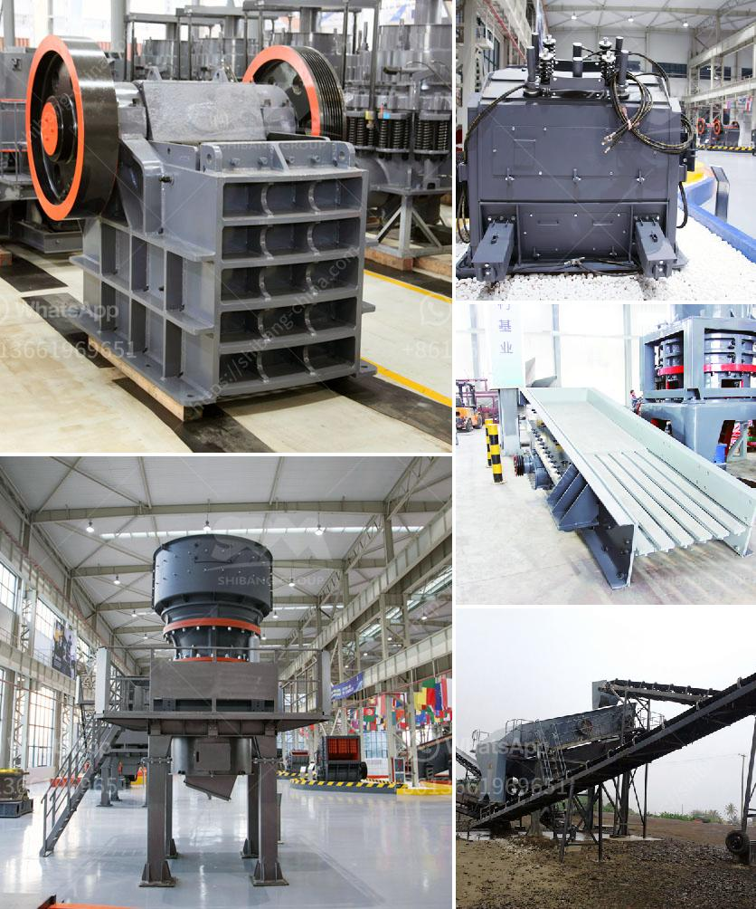

<h3>second hand hp cone crusher au</h3>
When it comes to buying heavy machinery, one such equipment that is highly sought after is the HP cone crusher. Known for its exceptional performance and durability, it is a preferred choice for many industries. However, acquiring a brand new HP cone crusher may not be within everyone's budget. Thankfully, there is a solution – second-hand HP cone crusher AU.

A second-hand HP cone crusher AU refers to a used machine that has been previously owned and operated. These crushers are often available at a lower cost compared to the new ones, making them an attractive choice for businesses looking to save money without compromising on quality. The availability of second-hand HP cone crushers AU offers numerous benefits.

First and foremost, purchasing a second-hand HP cone crusher AU allows businesses to acquire a high-quality machine without breaking the bank. The initial investment required for a new HP cone crusher can be significant, and small or medium-sized businesses may find it challenging to allocate such a large sum. However, a pre-owned crusher offers a more affordable option, opening up opportunities for businesses on a tighter budget.

Furthermore, second-hand HP cone crushers AU have already proven their efficiency in real-world applications. These machines have typically been used by other companies and have excelled in providing reliable and consistent performance. Therefore, buyers can have confidence in their operational capabilities, knowing that they have been tried and tested.

In addition to the cost advantage and proven performance, there is another crucial aspect to consider when buying a second-hand HP cone crusher AU – sustainability. The concept of sustainability has gained immense importance in recent years, and businesses are increasingly focusing on reducing their carbon footprint and minimizing waste. By opting for a second-hand crusher, buyers contribute to a more sustainable economy by extending the lifespan of machinery and preventing it from ending up in landfills.

However, it is important to exercise caution when purchasing a second-hand HP cone crusher AU. Buyers must thoroughly inspect the machine, ensuring that it is in good working condition and meets their specific requirements. Engaging the services of a professional to assess the crusher's quality and functionality is highly recommended before finalizing the purchase.

In conclusion, a second-hand HP cone crusher AU presents an excellent opportunity for businesses to acquire a high-performing machine at a fraction of the cost of a new one. With a proven track record, sustainability benefits, and the possibility of saving thousands of dollars, it is no wonder why an increasing number of businesses are opting for second-hand crushers. However, it is important to conduct thorough inspections to ensure the machine's reliability and suitability for your operations. By choosing a second-hand HP cone crusher AU, you can achieve productivity and efficiency without compromising your budget.
<h3>Contact us</h3><ul><li><strong>Whatsapp:&nbsp;<a href="https://wa.me/8613661969651">+8613661969651</a></strong></li><li><a href="https://swt.shibang-china.com/?git&amp;zhl&amp;second hand hp cone crusher au"><strong>Online Service(chat now)</strong></a></li></ul><h3>Related</h3><ul><li><a href='barite mill specifications.md'>barite mill specifications</a></li><li><a href='coal grinding mill.md'>coal grinding mill</a></li><li><a href='barite washing equipment.md'>barite washing equipment</a></li><li><a href='fuel rate for rock crushers.md'>fuel rate for rock crushers</a></li><li><a href='second hand automatic crusher plant.md'>second hand automatic crusher plant</a></li></ul>