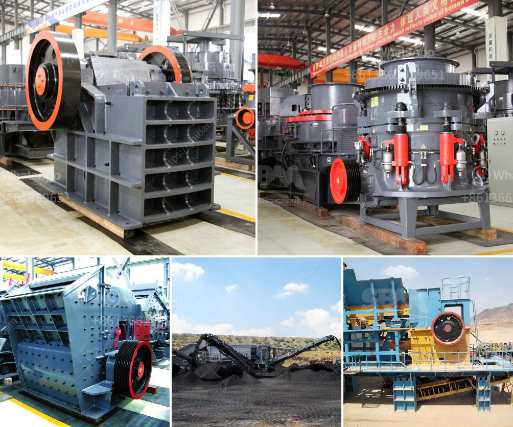

<h3>second hand stone production line for</h3>
Second-hand stone production lines offer an economical and sustainable solution for businesses in the construction and mining industries. These production lines consist of various machinery and equipment required for stone crushing, screening, and sorting processes. Here, we will discuss the benefits and considerations of investing in a second-hand stone production line.

One of the most significant advantages of purchasing a used stone production line is cost savings. Second-hand equipment is typically much cheaper compared to new machinery, enabling businesses to acquire the necessary tools at a reduced investment. This cost advantage allows companies to allocate their resources more effectively, investing in other areas of their operations or expanding their businesses.

Additionally, second-hand stone production lines help promote sustainability. Reusing equipment reduces waste and minimizes the environmental impact associated with manufacturing new machinery. By opting for pre-owned machines, businesses contribute to a circular economy, where resources are utilized efficiently and waste is minimized.

However, when considering a second-hand stone production line, there are certain factors to keep in mind. Firstly, it is crucial to evaluate the condition and performance of the machinery. Conducting a thorough inspection, testing, and maintenance check is necessary to ensure that the equipment meets the desired quality standards. Engaging the services of a professional inspector or technician can provide valuable insights into the condition of the machines.

Furthermore, researching the reliability and reputation of the seller or dealer is essential. A reputable seller will provide accurate information about the equipment, its history, and any maintenance or repairs conducted on it. Reading customer reviews and seeking recommendations can also help in making an informed decision.

In conclusion, second-hand stone production lines offer an affordable and sustainable option for businesses in need of stone crushing and sorting equipment. The cost savings and environmental benefits of purchasing used machinery make it an attractive investment. However, a thorough evaluation of the equipment's condition and researching the seller's reputation are crucial to ensure a successful purchase. By considering these factors, businesses can acquire a reliable and cost-effective stone production line for their operations.
<h3>Contact us</h3><ul><li><strong>Whatsapp:&nbsp;<a href="https://wa.me/8613661969651">+8613661969651</a></strong></li><li><a href="https://swt.shibang-china.com/?git&amp;zhl&amp;second hand stone production line for"><strong>Online Service(chat now)</strong></a></li></ul><h3>Related</h3><ul><li><a href='factory price tile adhesive manufacturing plant.md'>factory price tile adhesive manufacturing plant</a></li><li><a href='clay crusher machine for refractories.md'>clay crusher machine for refractories</a></li><li><a href='mobile coal washing plant south africa.md'>mobile coal washing plant south africa</a></li><li><a href='industrial grinder fine powder.md'>industrial grinder fine powder</a></li><li><a href='stone for stone mill.md'>stone for stone mill</a></li></ul>