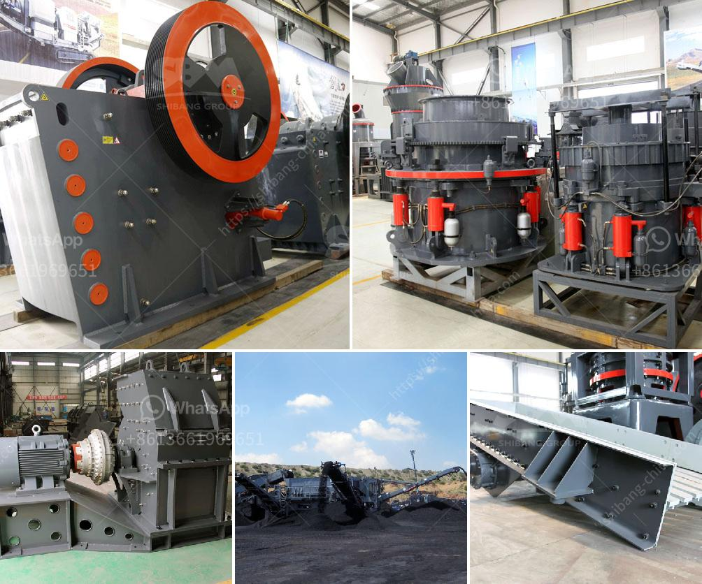

<h3>secondary cone crusher</h3>
The secondary cone crusher is a versatile piece of equipment that is used in a wide range of industries. It is commonly used in quarries, mining, and recycling of construction materials. The secondary cone crusher is equipped with the Nordberg® GP series™ cone crusher, which provides high crushing performance with optimized cavity design. This machine is used in various industries, such as mining, smelting, road construction, building materials, railways, water conservancy, and chemical industries.

One of the main features of the secondary cone crusher is its ability to produce a high-quality cubic-shaped end product. This is achieved through the use of a special crushing chamber design that allows the material to be crushed efficiently and evenly. The cone crusher's mantle and concave are specially designed to maximize the crushing surface area and enhance the crushing performance of the machine. This results in a more uniform product size distribution and a higher reduction ratio.

The secondary cone crusher is also equipped with advanced hydraulic clearing system, which can automatically remove the stuck material in the crushing chamber. This is a valuable feature that ensures continuous operation and reduces downtime caused by material blockages.

In addition, the secondary cone crusher is equipped with a reliable and efficient lubrication system. This system ensures the smooth operation of the machine and prolongs its service life. The lubrication system includes an oil tank, an oil pump, and a cooling system. The oil tank stores the lubricating oil, and the oil pump circulates the oil to the crusher's various moving parts. The cooling system helps to maintain an optimal operating temperature for the crusher, preventing overheating and potential damage to the machine.

The secondary cone crusher is easy to operate and maintain. It is equipped with a user-friendly control panel that allows operators to adjust and monitor various parameters of the crusher's operation. The machine is also equipped with an automatic setting system, which continuously adjusts the crusher's setting to maintain the desired product size.

In conclusion, the secondary cone crusher is an excellent choice for any size-reduction application. Its advanced features, such as high crushing performance, automatic clearing system, and efficient lubrication system, ensure reliable operation and low maintenance requirements. Whether it is used in quarrying, mining, or recycling, the secondary cone crusher delivers superior crushing performance and high-quality end products.
<h3>Contact us</h3><ul><li><strong>Whatsapp:&nbsp;<a href="https://wa.me/8613661969651">+8613661969651</a></strong></li><li><a href="https://swt.shibang-china.com/?git&amp;zhl&amp;secondary cone crusher"><strong>Online Service(chat now)</strong></a></li></ul><h3>Related</h3><ul><li><a href='crusher china jaw crusher cost.md'>crusher china jaw crusher cost</a></li><li><a href='ball mill in china.md'>ball mill in china</a></li><li><a href='quartz stone crushers materials.md'>quartz stone crushers materials</a></li><li><a href='cone crusher for sale nigeria.md'>cone crusher for sale nigeria</a></li><li><a href='used mine equipment price.md'>used mine equipment price</a></li></ul>