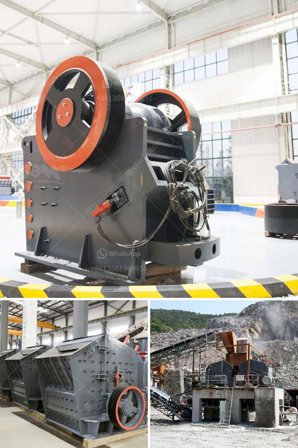

<h3>sell stone crusher in philippines</h3>
The Philippines is rich in various mineral resources. Recently, mining operators have been clamoring for the exploration and development of these mineral deposits to meet the increasing demand for stones, sand, gravel, and other construction materials. The crushing industry plays a vital role in the development of the country's infrastructure, providing materials needed for roads, bridges, buildings, and other construction projects.

One of the essential equipment in the crushing industry is the stone crusher. It is used to break large rocks into smaller pieces as they pass through the crusher. Many industries use stone crushers to crush the stones they produce at various sizes. These are excellent raw materials for various construction projects such as highways, railways, buildings, bridges, and even airports.

In the Philippines, there is a growing demand for stone crushers because of the increasing construction activities, road projects, and other infrastructure projects. These projects require the right equipment that can efficiently crush stones and transform them into gravel or sand, which are essential in the construction industry.

Selling stone crushers in the Philippines is relatively easy because of the wide availability of these machines in the local market. The presence of major international brands allows Filipinos to have a wider selection of stone crushers, making it easier for buyers to choose from different models with different specifications.

To cater to this growing demand for stone crushers in the Philippines, many distributors and manufacturers have specialized in providing these machines within the country. These businesses ensure that there is a constant supply of stone crushers to accommodate the needs of the construction industry.

Aspiring entrepreneurs who wish to venture into selling stone crushers in the Philippines must consider several factors. Firstly, they need to research the specific needs of their target market. It is crucial to understand the requirements of local construction companies, contractors, and builders regarding stone crushers' size and specifications.

Secondly, it is necessary to establish strong relationships with reliable manufacturers and distributors of stone crushers. Ensuring a consistent supply of high-quality machines is pivotal in building a trustworthy reputation among potential customers. This can also involve collaborations with manufacturers that offer after-sales services such as maintenance, repair, and spare parts availability.

Furthermore, effective marketing strategies will help raise awareness about the availability of stone crushers in the Philippines. Utilizing digital platforms, social media, and advertising initiatives can help reach a wider audience and generate more leads for potential customers.

In conclusion, selling stone crushers in the Philippines can be a lucrative business venture for aspiring entrepreneurs. With the country's booming construction industry, there is a growing demand for stone crushers that can efficiently crush and transform stones into gravel or sand, essential in construction projects. Building strong relationships with reliable manufacturers and implementing effective marketing strategies are vital in this endeavor. With careful planning and execution, entrepreneurs can capitalize on the Philippines' need for stone crushers and contribute to the country's infrastructure development.
<h3>Contact us</h3><ul><li><strong>Whatsapp:&nbsp;<a href="https://wa.me/8613661969651">+8613661969651</a></strong></li><li><a href="https://swt.shibang-china.com/?git&amp;zhl&amp;sell stone crusher in philippines"><strong>Online Service(chat now)</strong></a></li></ul><h3>Related</h3><ul><li><a href='benefits of vsi crusher.md'>benefits of vsi crusher</a></li><li><a href='gold wash plant manufacturer in india.md'>gold wash plant manufacturer in india</a></li><li><a href='cone crusher secondary price.md'>cone crusher secondary price</a></li><li><a href='stone crusher plant cost in saudi.md'>stone crusher plant cost in saudi</a></li><li><a href='mobile crushing plants.md'>mobile crushing plants</a></li></ul>