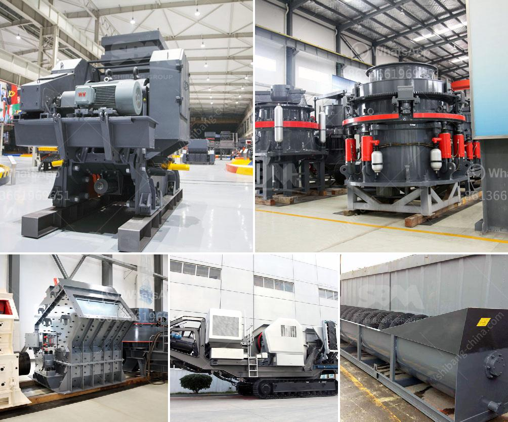

<h3>serie dgs utiliza en piedra linea de produccion</h3>
La serie DGS es una línea de producción altamente eficiente y confiable que se utiliza en la producción de piedras para una amplia gama de aplicaciones industriales y de construcción. Esta línea de producción ha sido diseñada específicamente para satisfacer las demandas de las empresas que se dedican a la fabricación de piedras artificiales, ofreciendo una solución integral y rentable para la producción en masa.

La línea de producción DGS combina una serie de equipos especializados que trabajan en conjunto para crear piedras de alta calidad y durabilidad. Estos equipos incluyen trituradoras de mandíbula, trituradoras de impacto, trituradoras de cono y cribadoras vibratorias, entre otros. Cada uno de estos equipos cumple una función específica y se complementan entre sí para optimizar el proceso de producción.

Una de las características más destacadas de la serie DGS es su sistema de control automatizado, que permite supervisar y regular eficientemente el proceso de producción. Esto garantiza un rendimiento constante y una producción de alta calidad, minimizando la intervención humana y reduciendo los costos de mano de obra.

La serie DGS también se destaca por su eficiencia energética. Los equipos utilizados en esta línea de producción han sido diseñados con tecnología de vanguardia que optimiza el consumo de energía sin comprometer la calidad del producto final. Esto permite a las empresas ahorrar en costos de operación y reducir su huella de carbono.

Además, la serie DGS cuenta con un diseño modular y flexible que facilita su adaptación a diferentes necesidades y condiciones de producción. Esto permite a las empresas ajustar y personalizar la línea de producción según sea necesario, optimizando así su capacidad de producción y maximizando su rentabilidad.

En resumen, la serie DGS es una línea de producción altamente eficiente y confiable que se utiliza en la fabricación de piedras para una variedad de aplicaciones industriales y de construcción. Con su sistema de control automatizado, su eficiencia energética y su diseño modular, esta línea de producción ofrece a las empresas una solución integral y rentable para la producción en masa de piedras de alta calidad.
<h3>Contact us</h3><ul><li><strong>Whatsapp:&nbsp;<a href="https://wa.me/8613661969651">+8613661969651</a></strong></li><li><a href="https://swt.shibang-china.com/?git&amp;zhl&amp;serie dgs utiliza en piedra linea de produccion"><strong>Online Service(chat now)</strong></a></li></ul><h3>Related</h3><ul><li><a href='crusher conveyor belts zimbabwe.md'>crusher conveyor belts zimbabwe</a></li><li><a href='wet ultra fine fine grinding equipment.md'>wet ultra fine fine grinding equipment</a></li><li><a href='gold mining mining gold mining cost.md'>gold mining mining gold mining cost</a></li><li><a href='cement clinker grinding plant cost.md'>cement clinker grinding plant cost</a></li><li><a href='company profile for suppliers of mining equipment.md'>company profile for suppliers of mining equipment</a></li></ul>