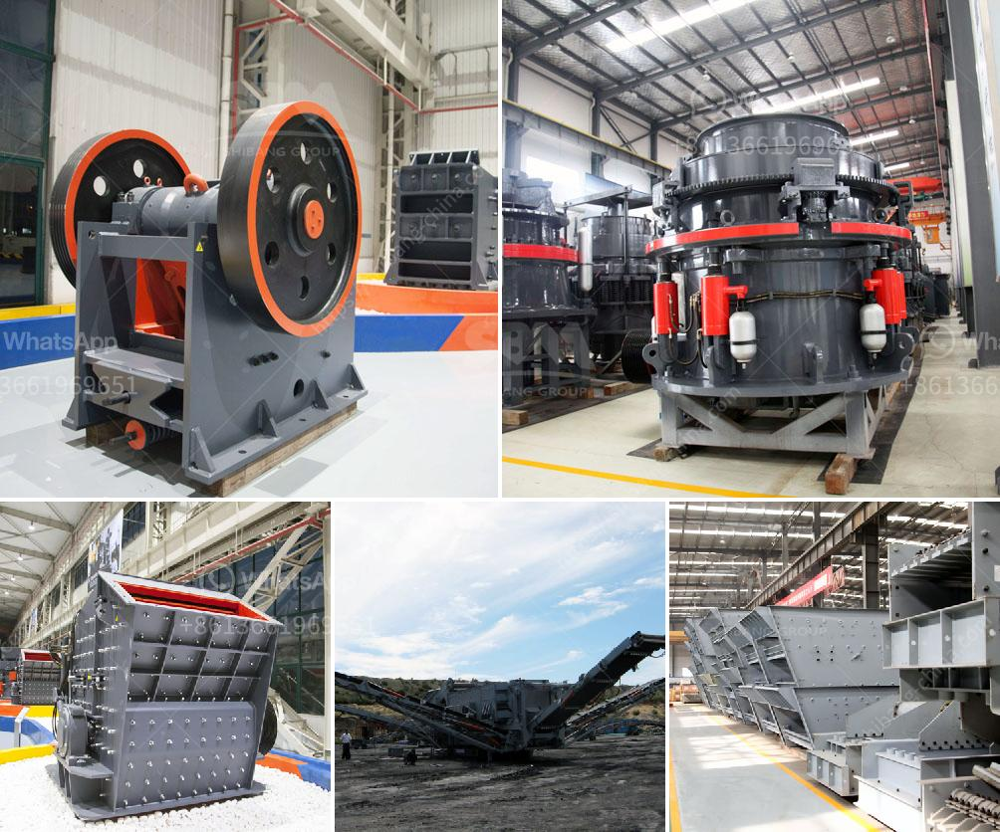

<h3>sewa rental stone crusher</h3>
Sewa Rental Stone Crusher is a company that provides assistance in renting a stone crusher to various clients, from small-scale industries to large-scale industries. Whether you are working in the construction industry, providing services to the mining sector, or conducting research in the agriculture sector, these machines are essential for various purposes.

Stone crushers are used to break down rocks and other hard materials into smaller, more manageable pieces. These pieces can be used for various applications, such as road construction, building construction, landscaping, and even gardening. They can also be used to crush stones into different sizes, which can be utilized for different purposes.

The process of renting a stone crusher from Sewa Rental Stone Crusher is very simple and straightforward. First, you need to contact the company and discuss your requirements with them. You will need to provide information about the type of stone crusher you need, the size of the stones you want to crush, and the expected output size. Once the company has all the necessary details, they will provide you with a quotation that includes the rental fee, duration of the rental, delivery charges, and any other additional charges.

Once you agree to the terms and conditions, the stone crusher will be delivered to your location and set up by the company's professionals. They will also provide you with a demonstration on how to operate the machine safely and effectively. In case you encounter any issues or have any questions during the rental period, you can reach out to the company's customer support team, who will be available to assist you.

Renting a stone crusher has many advantages over buying one. Firstly, it eliminates the need for a large upfront investment, which can be quite costly. It also saves you the hassle of finding storage space for the machine when it is not in use. Additionally, when you rent a stone crusher, you have the flexibility to choose the duration of the rental according to your project's requirements. Whether you need it for a few days or several months, the company can provide you with a rental plan that suits your needs.

Furthermore, renting a stone crusher allows you to always have access to the latest and most efficient models available in the market. The company regularly updates its fleet of stone crushers to ensure that their clients can benefit from improved performance, reduced downtime, and increased productivity. This means that you can always rely on their machines to get the job done efficiently and effectively.

In conclusion, Sewa Rental Stone Crusher is a reliable and trustworthy solution for all your stone crushing needs. Their rental service allows you to access high-quality stone crushers at a fraction of the cost of purchasing one. So, if you are in need of a stone crusher for your next project, consider renting one from Sewa Rental Stone Crusher and experience the benefits yourself.
<h3>Contact us</h3><ul><li><strong>Whatsapp:&nbsp;<a href="https://wa.me/8613661969651">+8613661969651</a></strong></li><li><a href="https://swt.shibang-china.com/?git&amp;zhl&amp;sewa rental stone crusher"><strong>Online Service(chat now)</strong></a></li></ul><h3>Related</h3><ul><li><a href='cost of setting up a quarry crusher plant.md'>cost of setting up a quarry crusher plant</a></li><li><a href='portable quarry crushers for sale in the usa.md'>portable quarry crushers for sale in the usa</a></li><li><a href='vibrating screen design products from philippines.md'>vibrating screen design products from philippines</a></li><li><a href='crusher for sale philippines.md'>crusher for sale philippines</a></li><li><a href='vrm vertical roller mill.md'>vrm vertical roller mill</a></li></ul>