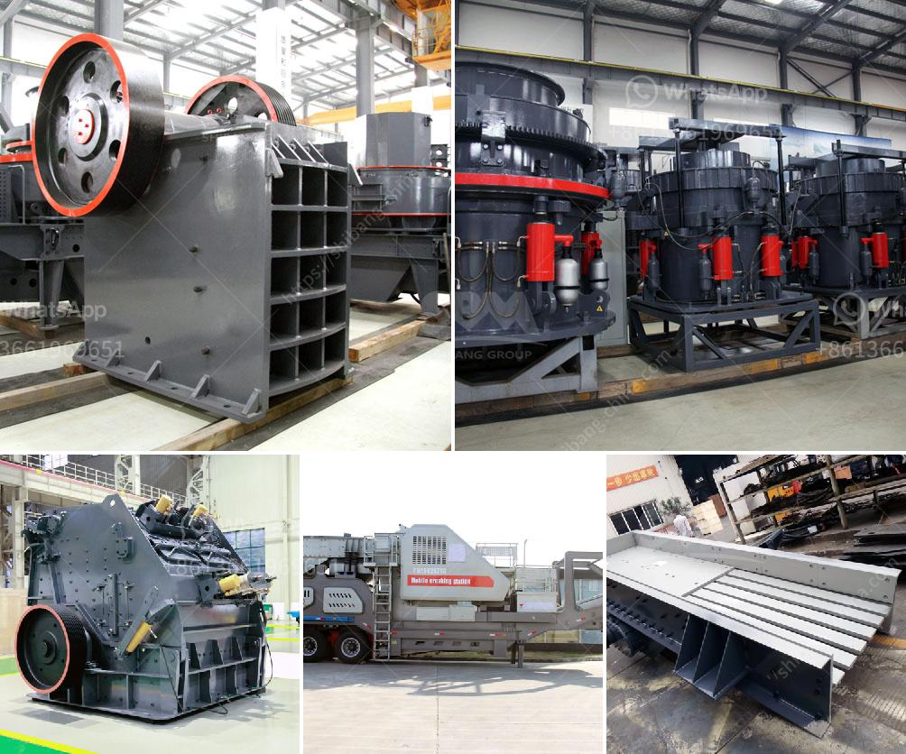

<h3>shafts for hammer mills</h3>
Hammer mills are widely used in various industries for grinding and crushing materials into smaller particles. These machines rely on a rotating shaft with hammers attached to it to reduce the size of the material being processed. The quality and performance of the shafts in hammer mills play a crucial role in the overall efficiency of the machine.

A hammer mill shaft is a critical component that connects the motor to the rotor of the hammer mill. This shaft is responsible for the rotational movement of the hammers, which crush and grind the materials. The shaft needs to be strong and durable to withstand the forces generated by the rotating hammers and the materials being processed.

One of the key considerations for shafts in hammer mills is material selection. Commonly used materials for shafts in hammer mills include alloy steel, carbon steel, and stainless steel. Alloy steel is often preferred due to its high strength and resistance to wear and abrasion. Carbon steel is also a popular choice as it is cost-effective and provides good mechanical properties. Stainless steel, on the other hand, offers excellent corrosion resistance but is typically more expensive.

The dimensions and design of the shaft are also important factors to consider. The diameter and length of the shaft should be appropriate for the size and capacity of the hammer mill. A larger diameter shaft can provide better strength and reduce the risk of torsional loading. The length of the shaft should be carefully chosen to prevent excessive deflection, which can lead to reduced performance and premature failure.

Another crucial aspect of shaft design is the connection between the shaft and the rotor. There are several types of connections commonly used, such as keyways, splines, and flanges. The chosen connection method should ensure proper alignment and secure attachment, minimizing the risk of disconnection during operation. Regular maintenance and inspection of the shaft connections are necessary to ensure their integrity and prevent unexpected failures.

In addition to material selection and design, proper installation and maintenance are essential for maximizing the lifespan of the shaft. The shaft should be carefully aligned and balanced to minimize vibrations and ensure smooth operation. Regular lubrication of the bearings supporting the shaft is crucial for reducing friction and wear.

However, even with the best materials and maintenance practices, shafts can still experience wear and fatigue over time. It is crucial to monitor the performance of the shaft and promptly address any signs of wear or failure. Regular inspections, including visual checks and measurements, can help identify potential issues before they escalate into costly breakdowns.

In conclusion, the shafts in hammer mills are critical components that significantly impact the performance and efficiency of these machines. Material selection, dimensions, design, installation, and maintenance all play crucial roles in ensuring the optimal operation and longevity of the shaft. By investing in high-quality shafts and following best practices, industries can enhance the productivity and reliability of their hammer mills.
<h3>Contact us</h3><ul><li><strong>Whatsapp:&nbsp;<a href="https://wa.me/8613661969651">+8613661969651</a></strong></li><li><a href="https://swt.shibang-china.com/?git&amp;zhl&amp;shafts for hammer mills"><strong>Online Service(chat now)</strong></a></li></ul><h3>Related</h3><ul><li><a href='roller raymond mill with best price.md'>roller raymond mill with best price</a></li><li><a href='medium jaw crusher gold mill for sale.md'>medium jaw crusher gold mill for sale</a></li><li><a href='alluvial diamond processing plant container for sale.md'>alluvial diamond processing plant container for sale</a></li><li><a href='quarry crusher machine equipment in germany prices.md'>quarry crusher machine equipment in germany prices</a></li><li><a href='mineral grinding mill machine used for sale uk.md'>mineral grinding mill machine used for sale uk</a></li></ul>