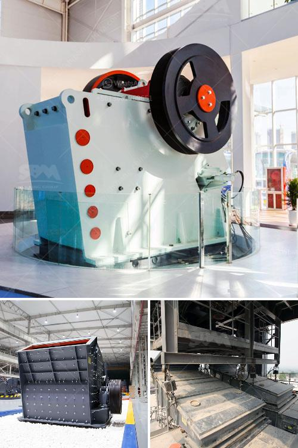

<h3>silica grinding machine manufacturer</h3>
With the growing popularity of industrialization, the demand for silica grinding machines has also witnessed a steady rise. The global market for silica grinding machines is highly competitive and characterized by a fragmented vendor landscape. In order to meet the ever-increasing demand, manufacturers are constantly striving to develop machines with advanced technology, innovative methods, and cutting-edge features. One such prominent player in the market is [Manufacturer Name], known for its state-of-the-art machinery and customer-centric approach.

[Manufacturer Name] is renowned as a leading silica grinding machine manufacturer with a broad range of machines catering to diverse industrial applications. The company takes pride in its commitment to delivering quality products, adhering to stringent quality control measures at every stage of manufacturing. These machines are designed to provide high-performance grinding solutions, ensuring precision and accuracy in the grinding process.

One of the key aspects that sets [Manufacturer Name] apart from its competitors is its focus on research and development. The company invests heavily in R&D activities to constantly innovate and improve its products. By staying updated with the latest technological advancements, [Manufacturer Name] ensures that its customers benefit from the most efficient and reliable grinding machines in the market.

In addition to technological innovation, [Manufacturer Name] also places great emphasis on sustainability. The company adopts eco-friendly manufacturing practices, minimizing its carbon footprint and promoting environmental responsibility. By incorporating energy-efficient components and optimizing performance, [Manufacturer Name] aims to reduce energy consumption while maintaining the highest level of productivity.

Another noteworthy feature of [Manufacturer Name] is its dedication to customer satisfaction. The company understands the unique requirements of each customer and provides tailored solutions accordingly. The team of experts at [Manufacturer Name] works closely with clients to analyze their needs and recommend the most suitable grinding machines. This personalized approach has earned the trust and loyalty of numerous clients around the world.

Furthermore, [Manufacturer Name] offers comprehensive after-sales support and service. The company ensures prompt assistance for installation, maintenance, and troubleshooting. With a strong network of service centers and technicians, [Manufacturer Name] ensures that its customers can rely on a seamless experience throughout the lifespan of the grinding machines.

In conclusion, [Manufacturer Name] emerges as a trusted silica grinding machine manufacturer with a strong foothold in the global market. With a focus on technological innovation, sustainability, and customer satisfaction, the company continues to provide cutting-edge solutions to meet the evolving needs of industries worldwide. As the demand for silica grinding machines grows, [Manufacturer Name] stands ready to meet the challenge, maintaining its position as a leader in the industry.
<h3>Contact us</h3><ul><li><strong>Whatsapp:&nbsp;<a href="https://wa.me/8613661969651">+8613661969651</a></strong></li><li><a href="https://swt.shibang-china.com/?git&amp;zhl&amp;silica grinding machine manufacturer"><strong>Online Service(chat now)</strong></a></li></ul><h3>Related</h3><ul><li><a href='stone crushing plant project report.md'>stone crushing plant project report</a></li><li><a href='magnetic iron ore processing plant cost.md'>magnetic iron ore processing plant cost</a></li><li><a href='stone crusher for sale in south africa.md'>stone crusher for sale in south africa</a></li><li><a href='vibrating feeder vs belt conveyor.md'>vibrating feeder vs belt conveyor</a></li><li><a href='stone crushers for sale uk finance.md'>stone crushers for sale uk finance</a></li></ul>