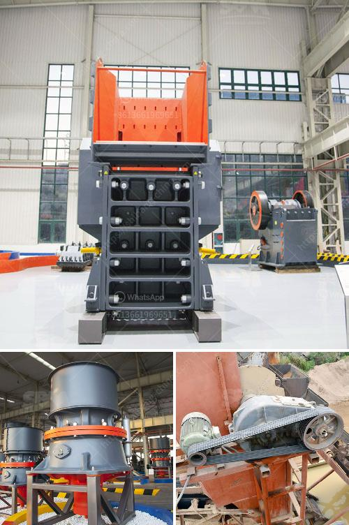

<h3>silica sand grinding machine cost</h3>
Silica sand is a quartz particle that has been purified and processed through grinding to ensure uniform particle size and stability. It is widely used in various industries such as construction, glass manufacturing, ceramics, and foundries. The demand for silica sand has been steadily increasing due to its diverse applications, leading to the need for efficient processing equipment like silica sand grinding machines.

Silica sand grinding machines are used to grind crushed silica sand into particles of the desired fineness, which can be used in various industrial applications. The cost of grinding machines for silica sand is often high as compared to traditional grinding equipment. In fact, silica sand grinding machines often cost more than the silica sand itself.

The grinding process using machines for grinding silica sand is highly energy-intensive. The cost of electricity is one of the major factors in determining the operational cost of silica sand grinding machines. Due to their high energy consumption, silica sand grinding machines can significantly contribute to the overall cost of the product.

Another cost factor associated with silica sand grinding machines is the maintenance and repair expenses. Like any other machine, silica sand grinding machines require regular maintenance to ensure their optimal functioning. This includes the replacement of worn-out parts, lubrication, and general cleaning. The cost of spare parts and maintenance services can add up to the overall cost of operating silica sand grinding machines.

Furthermore, the initial investment in silica sand grinding machines is relatively high. The cost of purchasing and installing grinding machines for silica sand can be significant, especially for small businesses. This initial capital expenditure should be carefully considered, taking into account the potential return on investment and the projected production volume.

Despite the high cost associated with silica sand grinding machines, their efficiency and productivity make them a worthwhile investment. Silica sand grinding machines can reduce processing time and labor costs, resulting in higher productivity and profitability. The consistent particle size achieved through grinding ensures the quality and performance of the final product, meeting the requirements of various industries.

Several factors can influence the cost of silica sand grinding machines. These include the type and size of the grinding machine, the quality and purity of the silica sand, the desired fineness of the final product, and the overall production volume. It is essential to take these factors into consideration when estimating the cost of silica sand grinding machines.

In conclusion, the cost of silica sand grinding machines can be relatively high due to factors such as energy consumption, maintenance, repair, and initial investment. However, the efficiency and productivity of these machines justify the cost, as they result in higher-quality products and increased profitability. Careful consideration of the various factors influencing the cost can help businesses make informed decisions regarding the purchase and operation of silica sand grinding machines.
<h3>Contact us</h3><ul><li><strong>Whatsapp:&nbsp;<a href="https://wa.me/8613661969651">+8613661969651</a></strong></li><li><a href="https://swt.shibang-china.com/?git&amp;zhl&amp;silica sand grinding machine cost"><strong>Online Service(chat now)</strong></a></li></ul><h3>Related</h3><ul><li><a href='jaw crusher and cone crusher manufacturers in dubai.md'>jaw crusher and cone crusher manufacturers in dubai</a></li><li><a href='mobile stone crusher with vibrating screen.md'>mobile stone crusher with vibrating screen</a></li><li><a href='cost of setting up quarry plant in nigeria.md'>cost of setting up quarry plant in nigeria</a></li><li><a href='stone crusher machine crusher.md'>stone crusher machine crusher</a></li><li><a href='components of the hammer crusher.md'>components of the hammer crusher</a></li></ul>