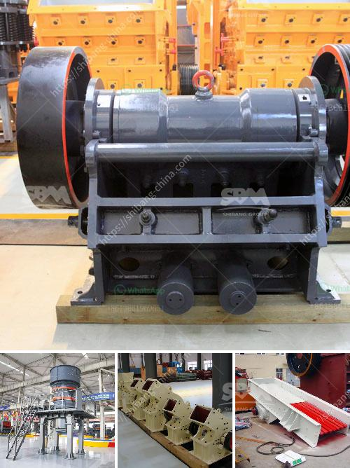

<h3>silica sand plant supplier in malaysia</h3>
Silica sand is essential for a variety of industrial purposes, such as glass making, concrete molding, and oil drilling. It is also used for foundry work and ceramics production. With such a wide range of applications, the demand for high-quality silica sand is on the rise.

In Malaysia, silica sand is abundant and readily available. This has led to the establishment of numerous silica sand plants across the country to cater to the growing demand. One of the leading suppliers of silica sand in Malaysia is Best Silica Sand Malaysia. They are known for providing top-quality silica sand that meets the industry's strict specifications.

Best Silica Sand Malaysia operates its own quarry and mines, ensuring a steady supply of silica sand. This eliminates the need to rely on external suppliers and allows them to control the entire production process, ensuring product quality. They also have advanced processing facilities that enable them to produce various grades of silica sand depending on customer requirements.

Furthermore, Best Silica Sand Malaysia takes pride in their commitment to sustainability. They use environmentally-friendly extraction and processing methods, minimizing the impact on the surrounding ecosystems. Additionally, they engage in responsible land rehabilitation practices to restore the quarry areas to their natural state.

As a trusted silica sand supplier, Best Silica Sand Malaysia serves a wide range of industries, including construction, manufacturing, and oil and gas. Their customers appreciate their reliable and timely delivery, ensuring uninterrupted operations. They also provide technical expertise and support to assist customers in selecting the most suitable silica sand for their specific applications.

In conclusion, the silica sand plant suppliers in Malaysia, such as Best Silica Sand Malaysia, play a crucial role in meeting the increasing demand for high-quality silica sand. Their commitment to sustainability, product quality, and customer satisfaction sets them apart in the industry. Whether it's for construction, manufacturing, or drilling purposes, these suppliers prove to be reliable partners in providing the essential silica sand needed for various industrial applications.
<h3>Contact us</h3><ul><li><strong>Whatsapp:&nbsp;<a href="https://wa.me/8613661969651">+8613661969651</a></strong></li><li><a href="https://swt.shibang-china.com/?git&amp;zhl&amp;silica sand plant supplier in malaysia"><strong>Online Service(chat now)</strong></a></li></ul><h3>Related</h3><ul><li><a href='china raymond mill company.md'>china raymond mill company</a></li><li><a href='mining processing machine prices.md'>mining processing machine prices</a></li><li><a href='stone crusher aggregate supplier kota.md'>stone crusher aggregate supplier kota</a></li><li><a href='ballast ore crusher for sale in kenya.md'>ballast ore crusher for sale in kenya</a></li><li><a href='stone crusher sales company in kenya.md'>stone crusher sales company in kenya</a></li></ul>