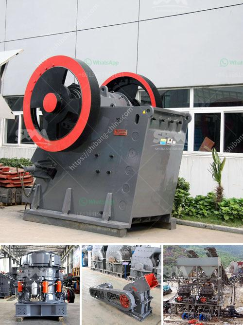

<h3>silica sand processing equipment</h3>
Silica sand is used throughout the world for various purposes, ranging from construction to industrial uses. Silica sand processing equipment is used in a variety of applications, such as mining and milling, to help producers reduce their environmental impact and create sustainable products.

Silica sand, also known as quartz sand, is a type of mineral that is commonly found in nature. It is used for a wide range of applications, including glass making, building materials, and construction. However, silica sand needs to be processed before it can be used in these various industries.

One of the main challenges in processing silica sand is the presence of impurities, such as iron and aluminum. These impurities can affect the quality of the sand and reduce its usability. To remove these impurities and create high-quality silica sand, specialized equipment is required.

There are several types of equipment used in the processing of silica sand. Some of the most common equipment includes screens, crushers, and washing machines. Each piece of equipment is designed to remove a specific type of impurity, allowing producers to generate high-quality silica sand.

Screens are used to separate the silica sand particles based on their size. Different sizes of screens are used depending on the desired size of the sand particles. This is followed by crushing equipment to break down the larger particles into smaller pieces.

Once the silica sand particles have been sized and crushed, they are typically washed to remove any remaining impurities. Washing machines are used to remove impurities such as clay and organic matter. This allows producers to create pure silica sand that meets the required specifications for various applications.

In addition to screens, crushers, and washing machines, other types of equipment may be used depending on the specific requirements of the processing plant. This may include magnetic separators to remove iron impurities, or attrition scrubbers to remove surface coatings on the sand particles.

The choice of equipment and the specific processes used will vary depending on the properties of the silica sand, as well as the desired end-use application. For example, high-purity silica sand used in the production of glass may require a different processing approach compared to silica sand used in construction materials.

Overall, silica sand processing equipment plays a crucial role in the production of high-quality silica sand. By removing impurities and creating a consistent particle size, these machines ensure that the final product meets the required specifications. This allows producers to create sustainable products that can be used in various industries.

In conclusion, silica sand processing equipment is essential for the production of high-quality silica sand. With the right equipment and processes, impurities can be removed, and the desired particle size can be achieved. This not only helps to create sustainable products, but it also reduces the environmental impact of silica sand processing.
<h3>Contact us</h3><ul><li><strong>Whatsapp:&nbsp;<a href="https://wa.me/8613661969651">+8613661969651</a></strong></li><li><a href="https://swt.shibang-china.com/?git&amp;zhl&amp;silica sand processing equipment"><strong>Online Service(chat now)</strong></a></li></ul><h3>Related</h3><ul><li><a href='different types of roller milling.md'>different types of roller milling</a></li><li><a href='crusher plant equipment.md'>crusher plant equipment</a></li><li><a href='raymond gypsum mill in india.md'>raymond gypsum mill in india</a></li><li><a href='ball mill grinding relation with quality pdf.md'>ball mill grinding relation with quality pdf</a></li><li><a href='ball mill mexico.md'>ball mill mexico</a></li></ul>